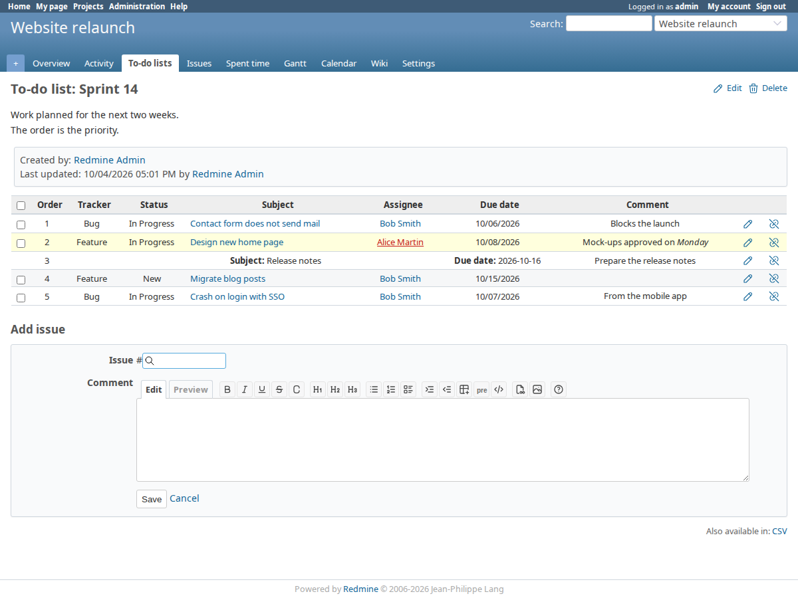
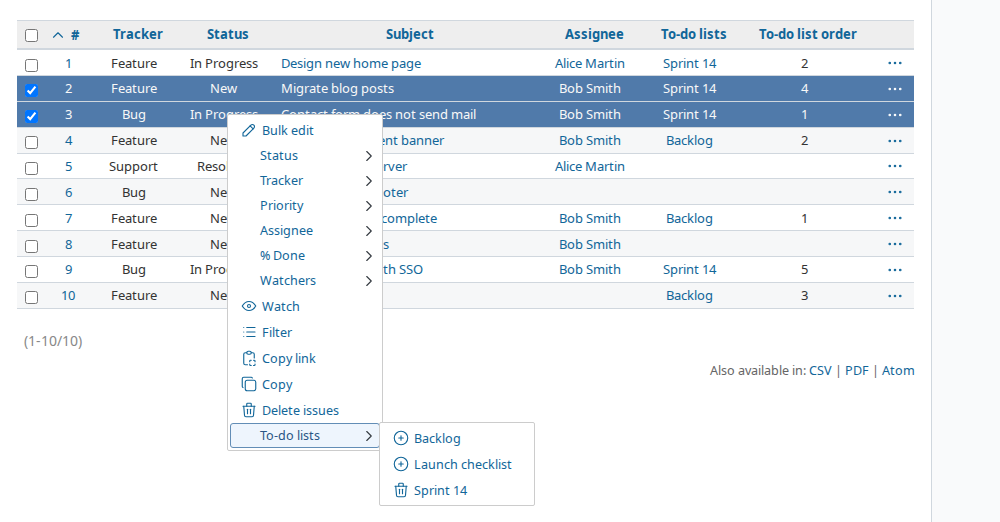
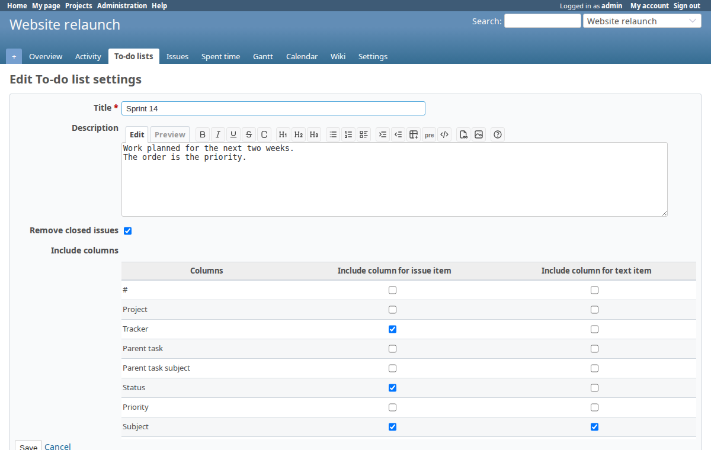

# Redmine Issue To-Do Lists Plugin
This plugin allows creating of individual to-do lists per project with the ability to add issues and order them manually, no matter what issue priority these issues have.

Link to Redmine plugin page: https://www.redmine.org/plugins/redmine_issue_todo_lists2

This is originally work from [Den / Canidas](https://github.com/canidas/redmine_issue_todo_lists)  
I was unable to contact the author to update the Redmine plugin page.  
Thank you for your great work.

## Compatibility
* Version 2.4.0 tested on Redmine 5.1, 6.0, 6.1 and 7.0
* Version 2.3.0 tested on Redmine 5.1, 6.0 and 6.1
* Version 2.2.2 >= Redmine 4 (including Redmine 6)
* Version 2.2.1 >= Redmine 4 (including Redmine 6)
* Version 2.0 >= Redmine 4 (including Redmine 5)
* Version 1.4 >= Redmine 4 (including Redmine 5)
* Version 1.3 for = Redmine 4 ONLY
* Version 1.2 for <= Redmine 3.4

Currently there's no difference between 1.2 and 1.3 except Redmine 4 compatibility
Version 2.2.2 introduces settings to show or hide to-do lists in the issue sidebar and edit form.

## Features
* Create to-do lists per project
* Add individual issues with or without comments per to-do list (also cross project possible)
* Or create to-do lists with solely text items (resolved)
* Order these issues / items per drag and drop
* Add and remove issues to/from to-do list by context menu (even bulk adding possible)
* Autocomplete for issues (as with issue relations)
* To-do lists show all configured default columns displayed on the normal issue list
* Remove closed issues from to-do list automatically (configurable per to-do list)
* Modify to-do list adherence from issue details and on edit
* Add issue to to-do list on creation
* Issue Filters and Columns

The `Dates` context menu moved to [redmine_context_menu_actions](https://github.com/jcatrysse/redmine_context_menu_actions) in version 2.3.0.

## Remarks
* Sorting the issue list on a to-do list column uses the first list title or the lowest position of each issue.

## Screenshots

More in the [screenshots folder](screenshots).

## Install
* Read the Redmine plugin installation wiki: http://www.redmine.org/wiki/redmine/Plugins
* Run `bundle install`
* Run the migration for database: `bundle exec rake redmine:plugins:migrate NAME=redmine_issue_todo_lists2 RAILS_ENV=production`
* Restart Redmine
* Login and configure rights and roles for this plugin
* Go to corresponding project settings and active project module *Issue To-do lists*
* Click *To-do lists* in project menu

## Update
* Update plugin with Git or download sources manually
* Run `bundle install`
* Run migration as described above
* Restart Redmine

## Tests
* `./.codex/redmine_clone.sh 6.1-stable` (or `5.1-stable`, `6.0-stable`, `7.0-stable`)
* `./.codex/test_setup.sh`
* `./.codex/test_plugin.sh`

Use a separate Redmine checkout: `test_setup.sh` replaces its `config/database.yml`. It also installs and starts the database server with sudo, unless `RITL_PROVISION_DB=0`.

## Uninstall
* Run migration backwards: `bundle exec rake redmine:plugins:migrate NAME=redmine_issue_todo_lists2 VERSION=0 RAILS_ENV=production`
* Remove plugin folder
* Restart Redmine

## License
GPLv2
