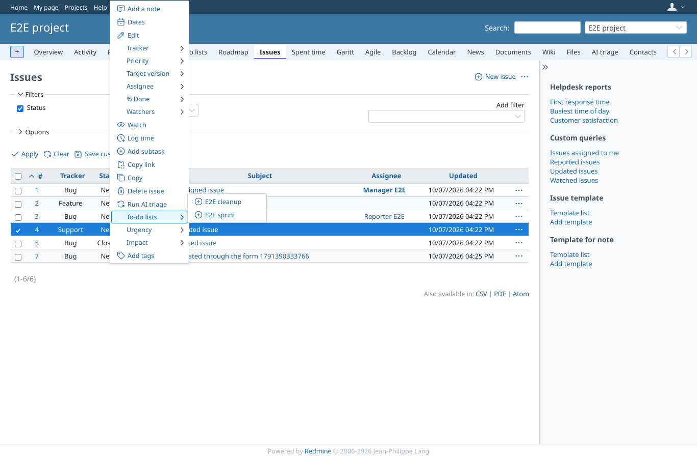
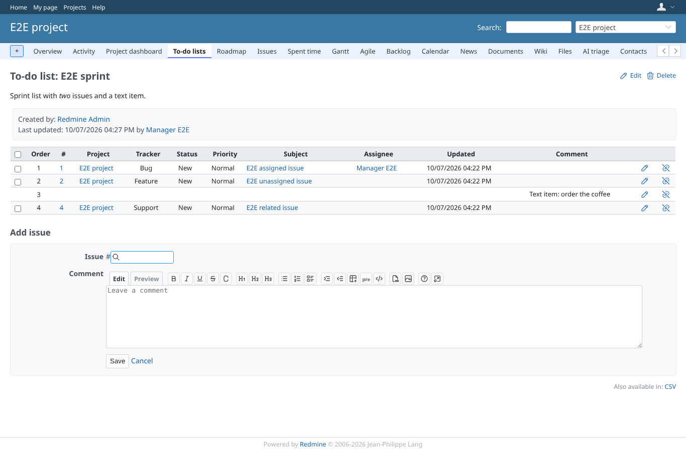
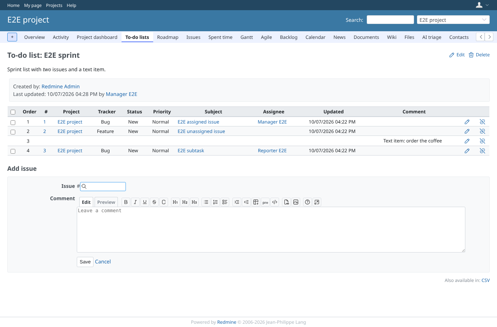
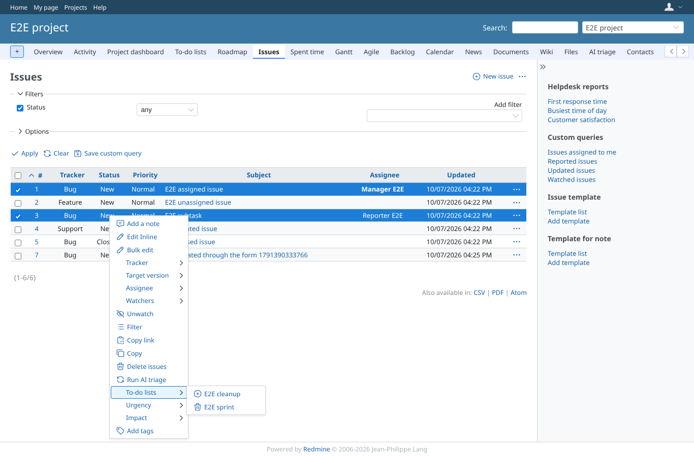
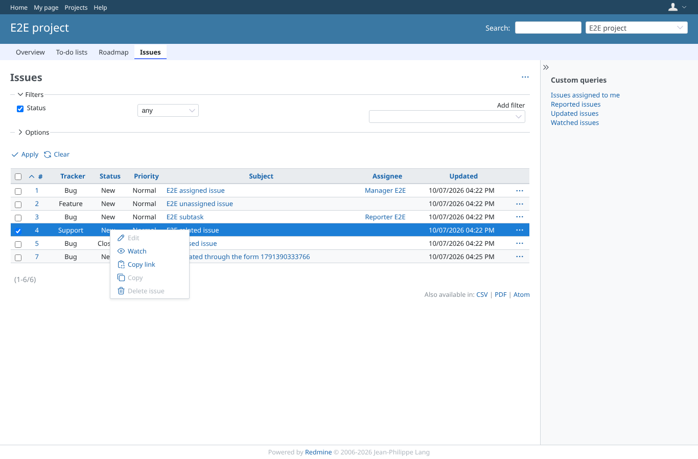
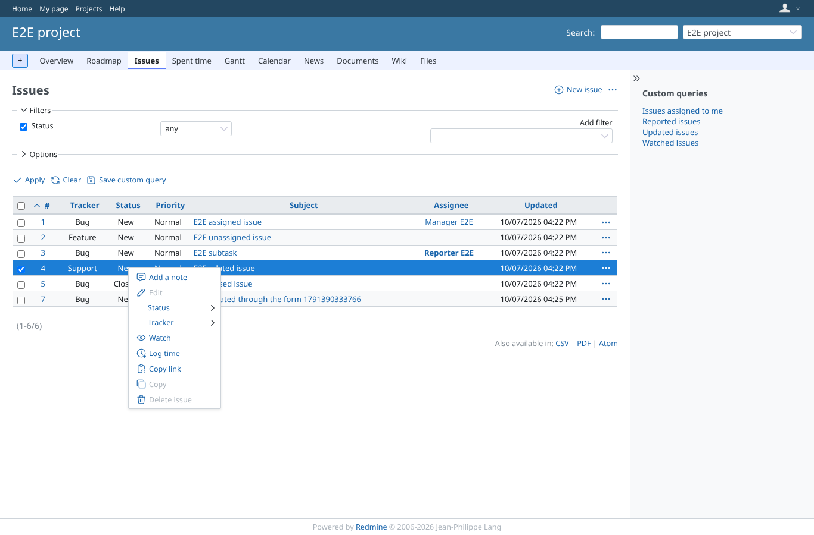

# context_menu

Run 2026-10-07T16:29:34.959Z against http://127.0.0.1:3003.

| screenshot | user | URL | shows |
|---|---|---|---|
|  | manager | `/projects/e2e-project/issues?set_filter=1&status_id=*&sort=id` | One issue not on E2E sprint: the folder offers to add it to each list |
|  | manager | `/projects/e2e-project/issue_todo_lists/1` | The issue is now on E2E sprint |
|  | manager | `/projects/e2e-project/issues?set_filter=1&status_id=*&sort=id` | The same issue: the folder now offers to take it off E2E sprint |
|  | manager | `/projects/e2e-project/issues?set_filter=1&status_id=*&sort=id` | Two issues, one listed: a warning entry adds the other ("E2E project - E2E sprint: add 1 of 2 items") |
|  | manager | `/projects/e2e-project/issue_todo_lists/1` | Both issues are on E2E sprint, the one that was there kept its place |
|  | manager | `/projects/e2e-project/issues?set_filter=1&status_id=*&sort=id` | Both listed: the entry takes both off the list |
|  | viewer | `/projects/e2e-project/issues?set_filter=1&status_id=*&sort=id` | A view-only member gets the core menu without the To-do lists folder |
|  | reporter | `/projects/e2e-project/issues?set_filter=1&status_id=*&sort=id` | A member without the plugin's permissions gets the core menu without the To-do lists folder |
