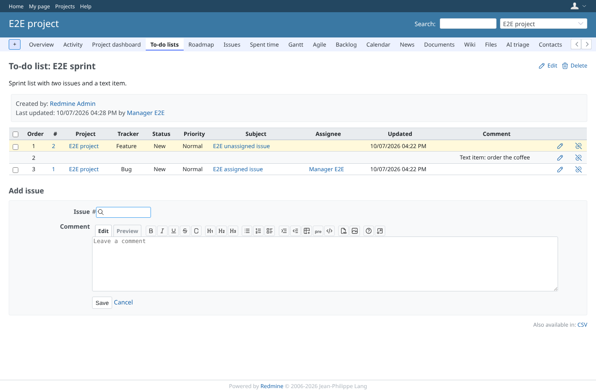

# csv_api

Run 2026-10-07T16:30:46.345Z against http://127.0.0.1:3003.

| screenshot | user | URL | shows |
|---|---|---|---|
|  | manager | `/projects/e2e-project/issue_todo_lists/1` | The list page offers the CSV export at the bottom |
