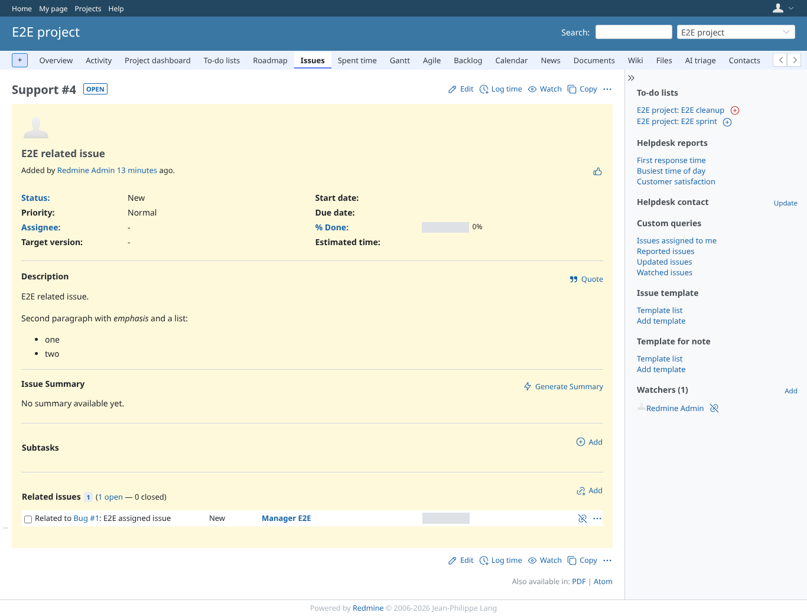
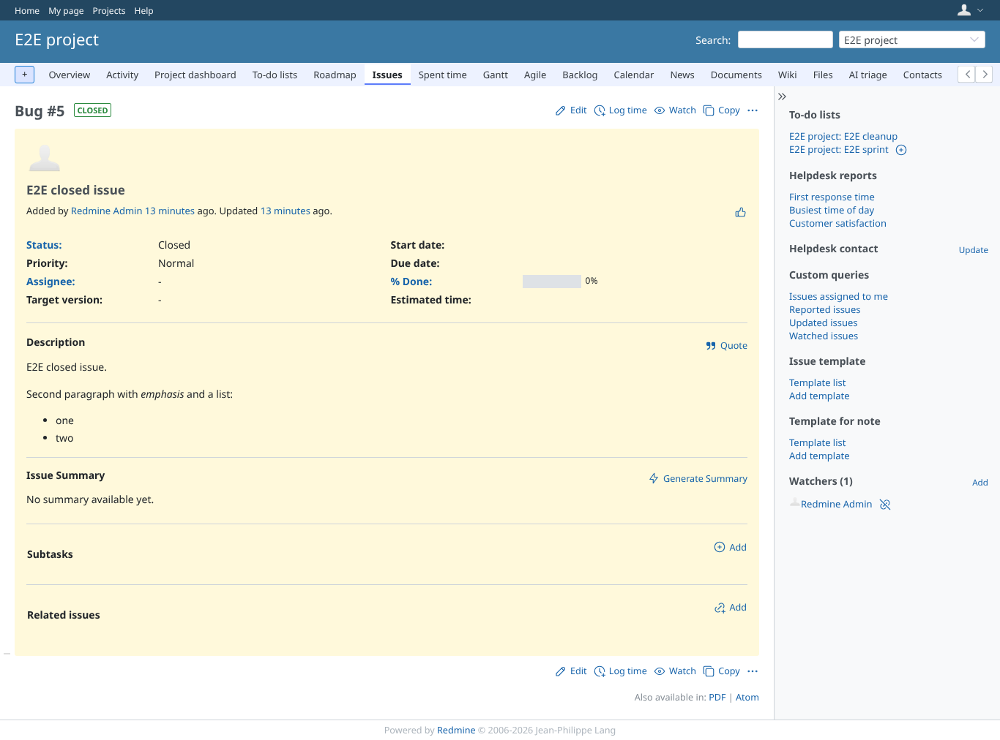

# issue_sidebar

Run 2026-10-07T16:35:45.852Z against http://127.0.0.1:3003.

| screenshot | user | URL | shows |
|---|---|---|---|
|  | manager | `/issues/4` | The sidebar lists the project's to-do lists with an add button on each list that does not hold the issue |
|  | manager | `/issues/4` | After the add the issue page shows the remove button for E2E cleanup |
|  | viewer | `/issues/4` | A view-only member sees the lists and a check mark where the issue is listed, no buttons |
|  | reporter | `/issues/4` | A member without the plugin's permissions sees no to-do list block |
|  | manager | `/issues/4` | After confirming the remove, the issue page is shown again with the add button |
|  | manager | `/issues/5` | A closed issue gets no add button for E2E cleanup, which removes closed issues |

## Problems

- /issues/4 as viewer: HTTP 403, expected 200
- viewer: no listed mark
- /issues/4 as reporter: HTTP 403, expected 200
