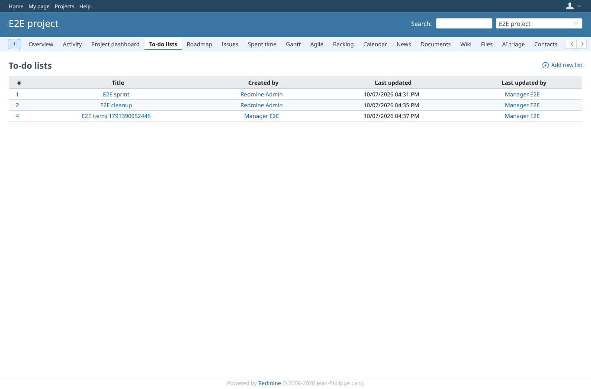
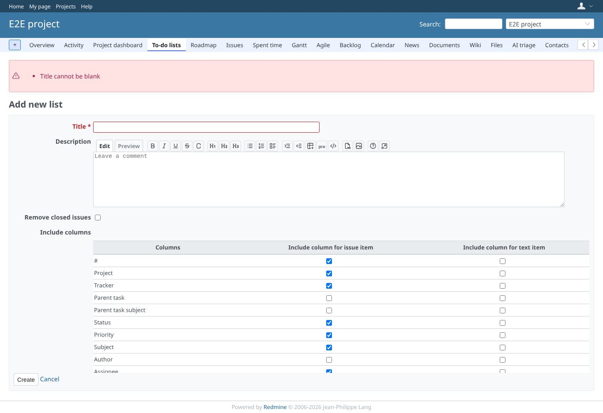
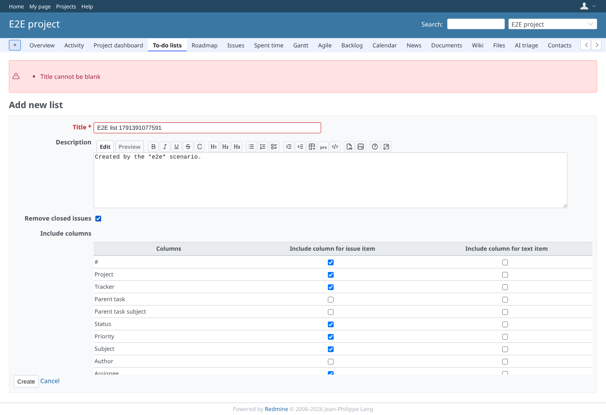
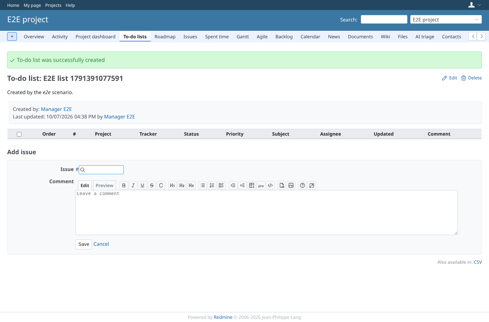
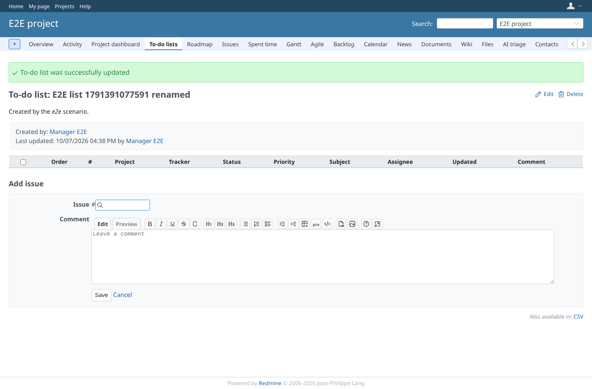
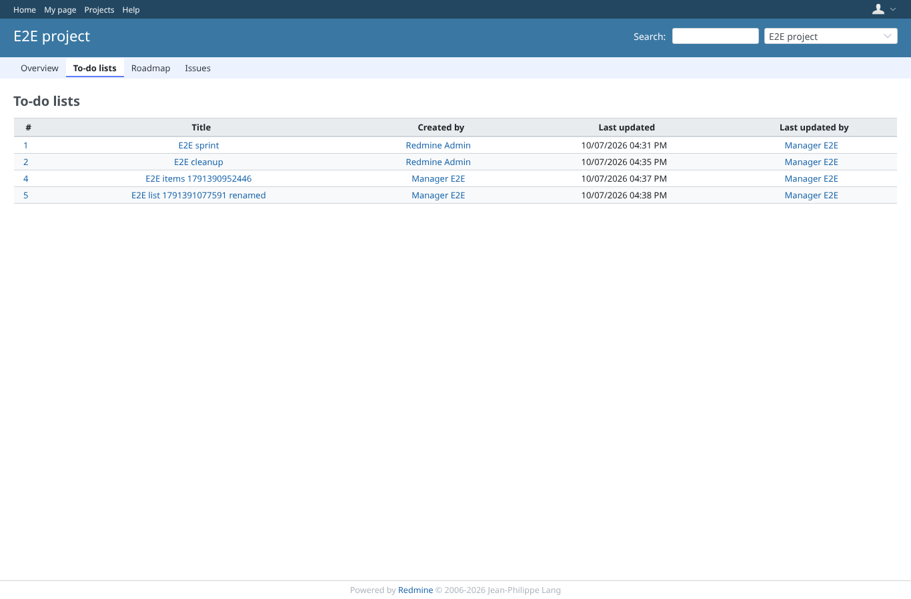
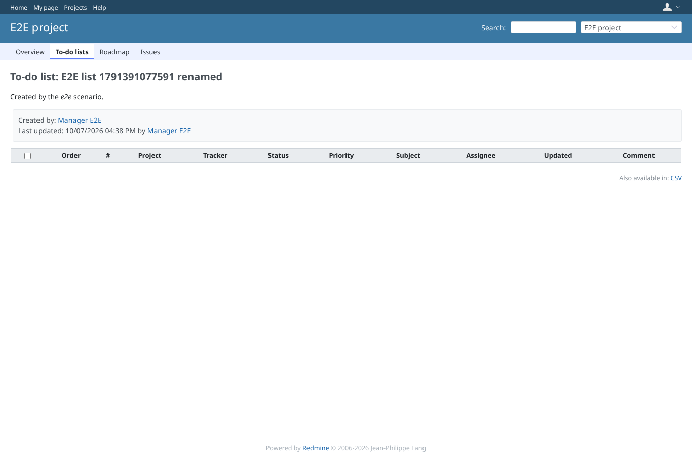
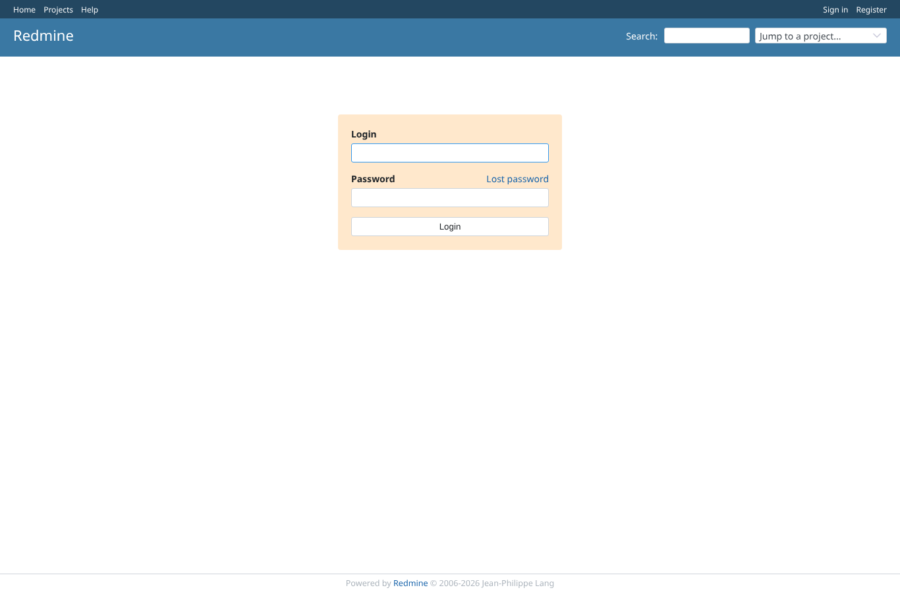
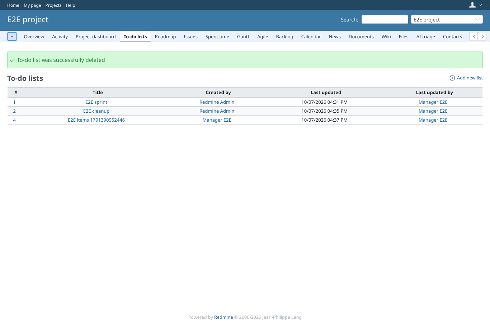

# lists

Run 2026-10-07T16:41:05.807Z against http://127.0.0.1:3003.

| screenshot | user | URL | shows |
|---|---|---|---|
|  | manager | `/projects/e2e-project/issue_todo_lists` | The project menu entry leads to the index of the project's lists, with the New link |
|  | manager | `/projects/e2e-project/issue_todo_lists` | A blank title is refused with a validation error, the form stays |
|  | manager | `/projects/e2e-project/issue_todo_lists` | The form with title, description, remove closed issues and the column choice |
|  | manager | `/projects/e2e-project/issue_todo_lists/5` | The new list is shown with its formatted description and a notice |
|  | manager | `/projects/e2e-project/issue_todo_lists/5` | Editing the list stores the new title |
|  | viewer | `/projects/e2e-project/issue_todo_lists` | A member who may only view lists sees the index without the New link |
|  | viewer | `/projects/e2e-project/issue_todo_lists/5` | The same member sees the list without edit, delete, add or ordering tools |
|  | viewer | `/projects/e2e-project/issue_todo_lists/new` | Creating a list without the permission is refused (403) |
|  | reporter | `/projects/e2e-project/issue_todo_lists` | A member without the plugin's permissions has no menu entry and is refused (403) |
|  | outsider | `/projects/e2e-private/issue_todo_lists` | The lists of a private project are refused to a non-member (403) |
|  | anonymous | `/login?back_url=http%3A%2F%2F127.0.0.1%3A3003%2Fprojects%2Fe2e-private%2Fissue_todo_lists%2F3` | Anonymous on a private project's list is sent to the login page |
|  | manager | `/projects/e2e-project/issue_todo_lists` | After confirming, the list is deleted and the index shows a notice |
