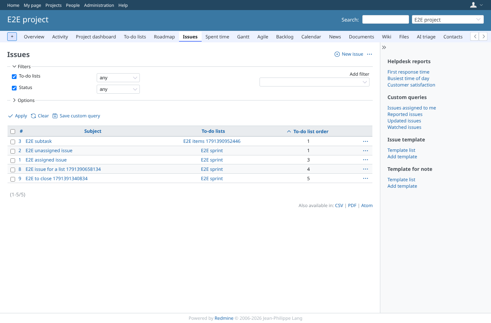
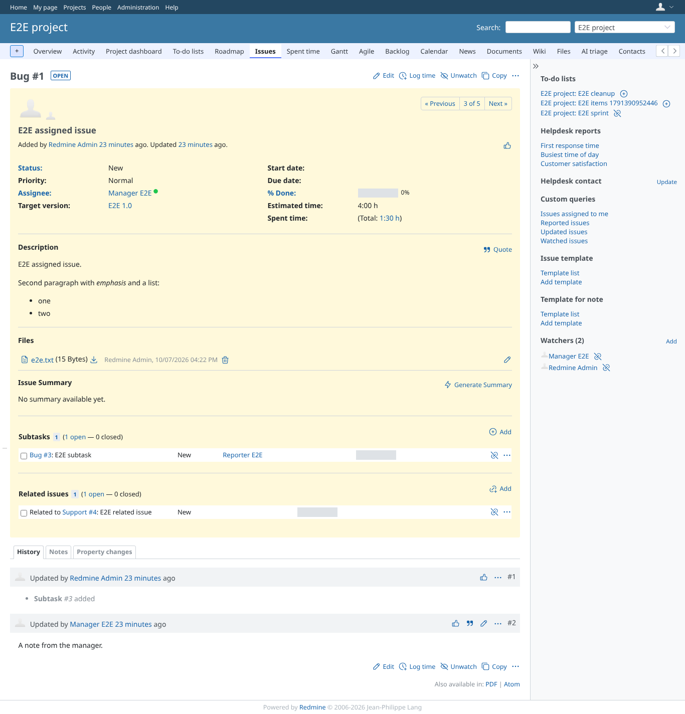
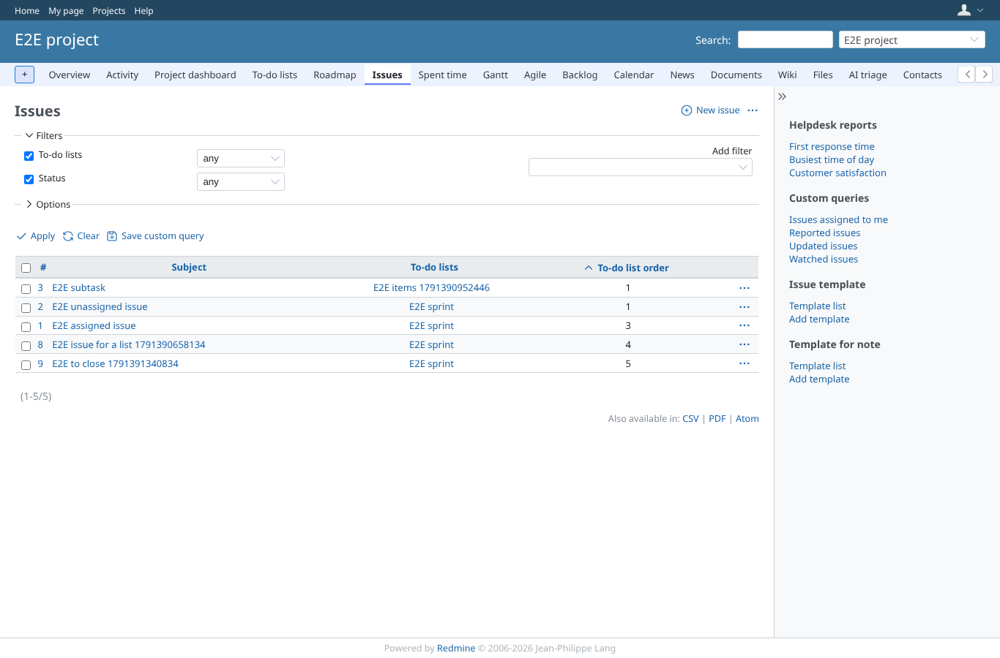
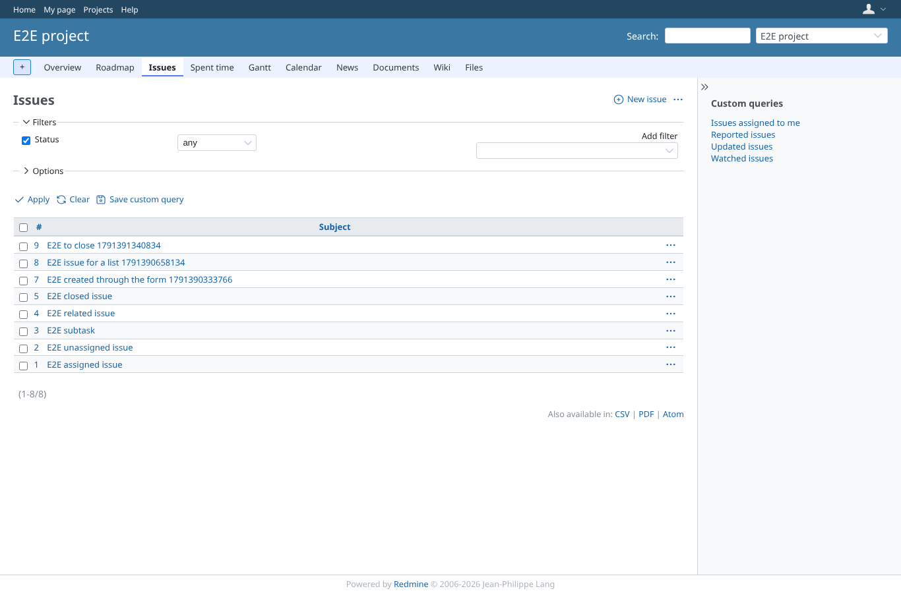

# together

Run 2026-10-07T16:47:05.787Z against http://127.0.0.1:3003.

| screenshot | user | URL | shows |
|---|---|---|---|
|  | admin | `/projects/e2e-project/settings` | Project > Settings answers 200 for admin |
|  | admin | `/projects/e2e-project/issues?set_filter=1&f[]=todo_lists_ids&op[todo_lists_ids]=*&f[]=status_id&op[status_id]=*&c[]=subject&c[]=issue_todo_list_titles.titles&c[]=issue_todo_list_item_orders.positions&sort=issue_todo_list_item_orders.positions` | The issue list filtered on "any to-do list", with the titles and order columns, sorted on the order, as admin |
|  | admin | `/issues/1` | An issue page with the to-do list block, as admin |
|  | manager | `/projects/e2e-project/settings` | Project > Settings answers 200 for manager |
|  | manager | `/projects/e2e-project/issues?set_filter=1&f[]=todo_lists_ids&op[todo_lists_ids]=*&f[]=status_id&op[status_id]=*&c[]=subject&c[]=issue_todo_list_titles.titles&c[]=issue_todo_list_item_orders.positions&sort=issue_todo_list_item_orders.positions` | The issue list filtered on "any to-do list", with the titles and order columns, sorted on the order, as manager |
|  | manager | `/issues/1` | An issue page with the to-do list block, as manager |
|  | reporter | `/projects/e2e-project/settings` | Project > Settings is refused to a member without the permission (403) |
|  | reporter | `/projects/e2e-project/issues?set_filter=1&f[]=todo_lists_ids&op[todo_lists_ids]=*&f[]=status_id&op[status_id]=*&c[]=subject&c[]=issue_todo_list_titles.titles&c[]=issue_todo_list_item_orders.positions&sort=issue_todo_list_item_orders.positions` | The same issue list URL works for a member without the plugin's permissions, without the filter and columns |
|  | reporter | `/issues/1` | The issue page answers 200 without the to-do list block |
|  | outsider | `/projects/e2e-private/issues` | The private project's issue list is refused to a non-member (403) |
|  | outsider | `/projects/e2e-project/issues?set_filter=1&f[]=todo_lists_ids&op[todo_lists_ids]=*&f[]=status_id&op[status_id]=*&c[]=subject&c[]=issue_todo_list_titles.titles&c[]=issue_todo_list_item_orders.positions&sort=issue_todo_list_item_orders.positions` | The public project's issue list answers 200 for a non-member, without the plugin's columns |

## Problems

- /projects/e2e-project/settings as admin: HTTP 500, expected 200
- /projects/e2e-project/settings as manager: HTTP 500, expected 200
- /issues/1 as reporter: HTTP 403, expected 200
