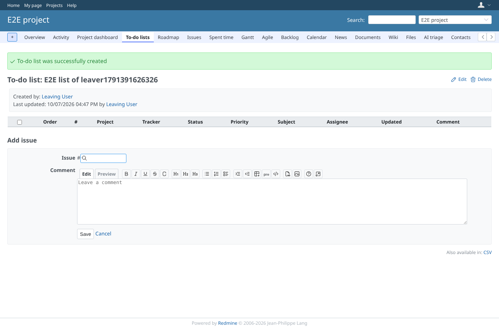
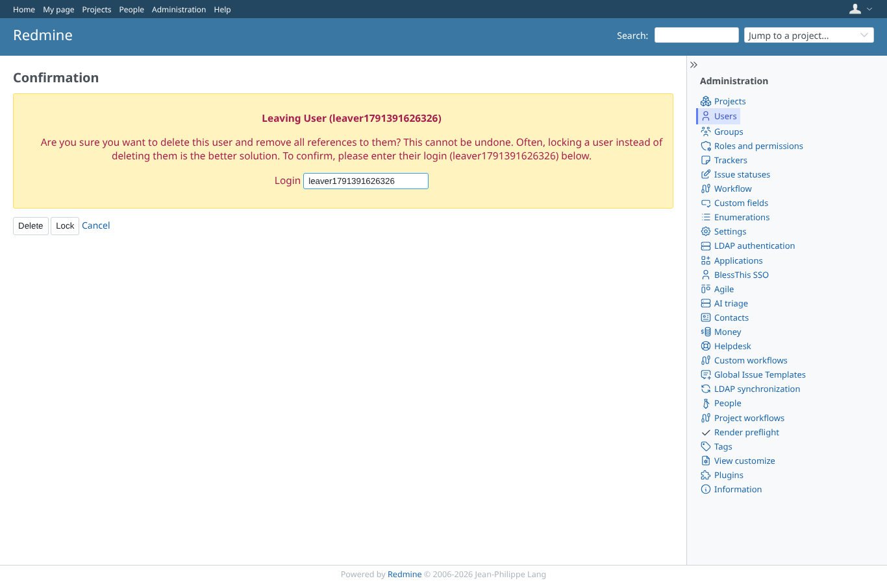
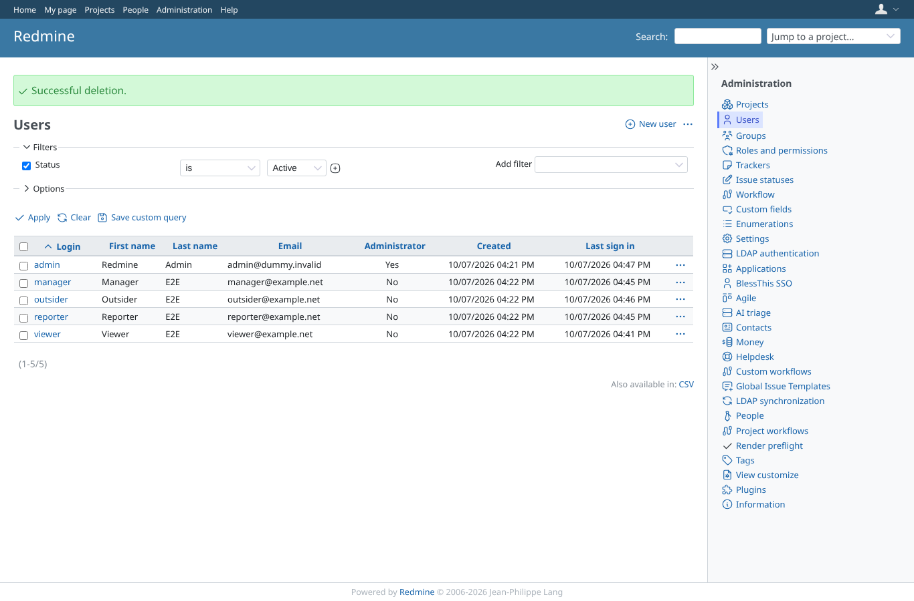
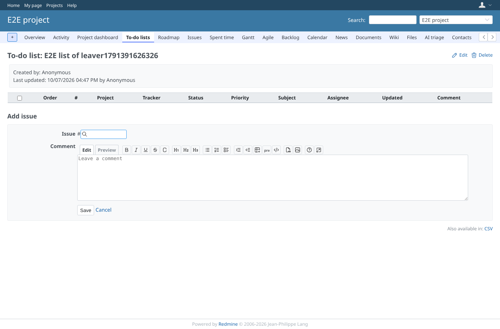

# user_delete

Run 2026-10-07T16:48:41.872Z against http://127.0.0.1:3003.

| screenshot | user | URL | shows |
|---|---|---|---|
|  | leaver1791391626326 | `/projects/e2e-project/issue_todo_lists/6` | A list created by the user who will be deleted |
|  | admin | `/users/9` | The administrator confirms the deletion of the account |
|  | admin | `/users` | The account is deleted without an error |
|  | manager | `/projects/e2e-project/issue_todo_lists/6` | The list is still there and names Anonymous as creator and last editor |
