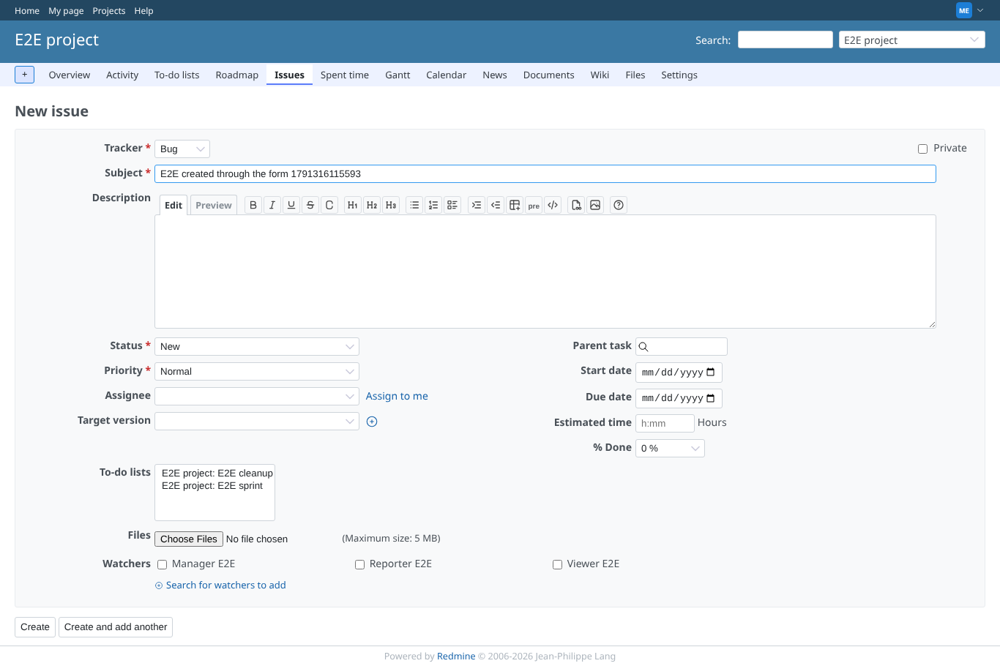
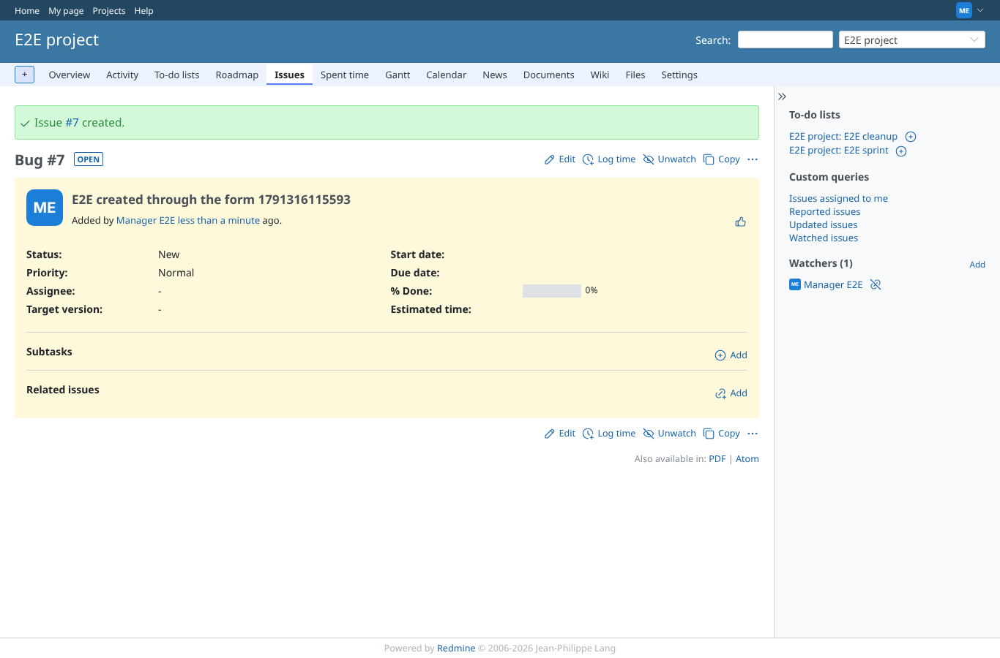
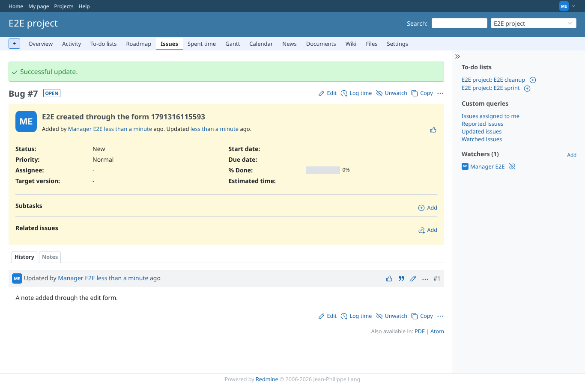
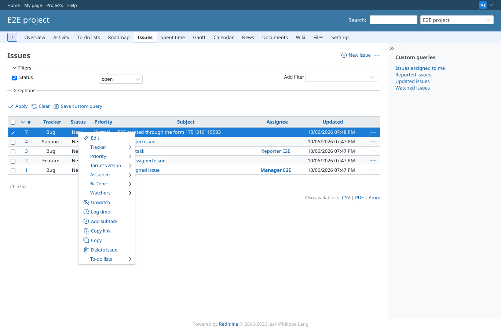
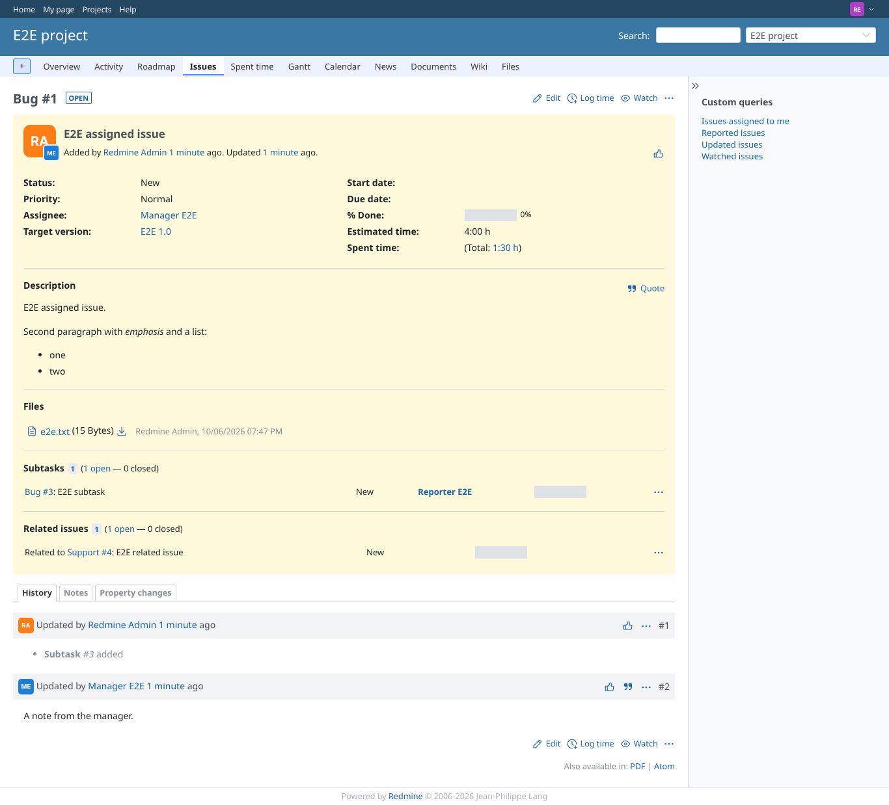

# core

Run 2026-10-06T19:48:44.041Z against http://127.0.0.1:3000.

| screenshot | user | URL | shows |
|---|---|---|---|
|  | manager | `/projects/e2e-project/issues/new` | New issue form as a member with every permission |
|  | manager | `/issues/7` | The issue is created and shown |
|  | manager | `/issues/7` | The note is saved and shown in the history |
|  | manager | `/projects/e2e-project/issues` | The context menu on the issue list |
|  | reporter | `/issues/1` | An issue seen by a member without the plugin's permissions |
|  | outsider | `/projects/e2e-private` | A private project is refused to a non-member |
