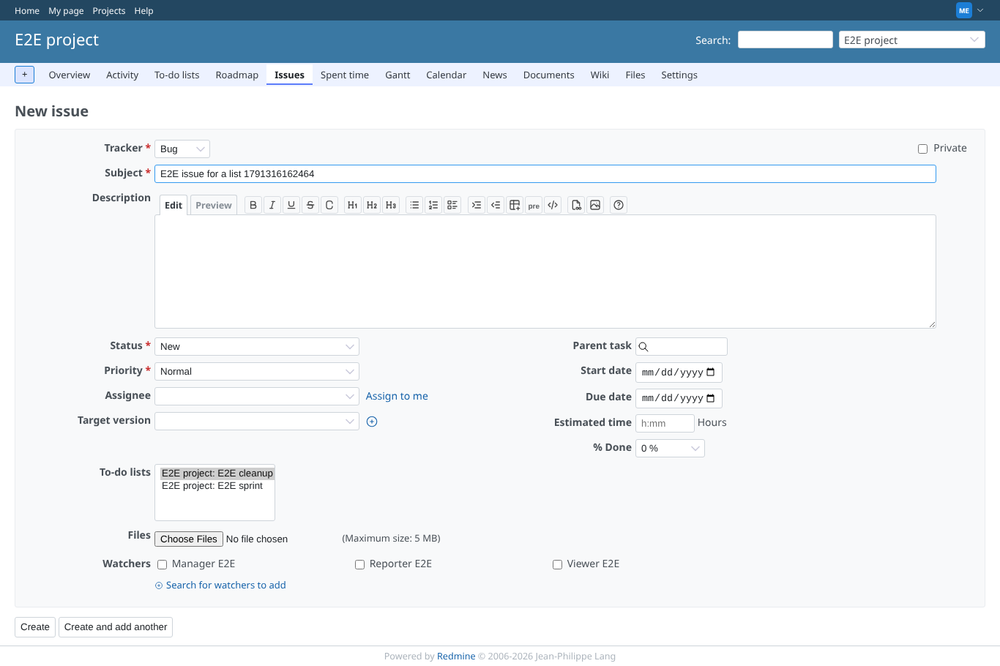
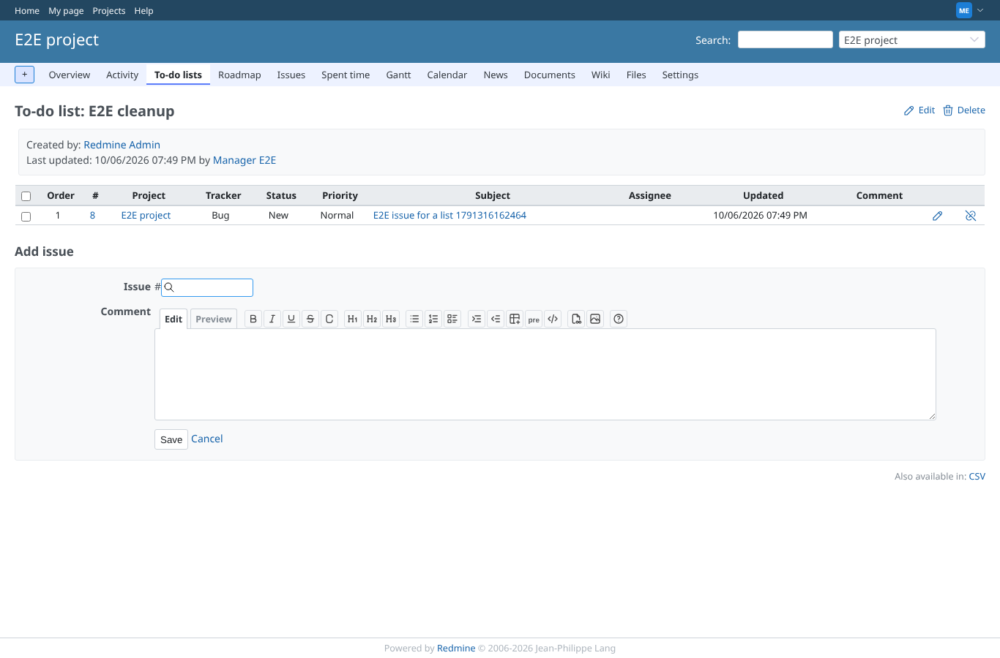
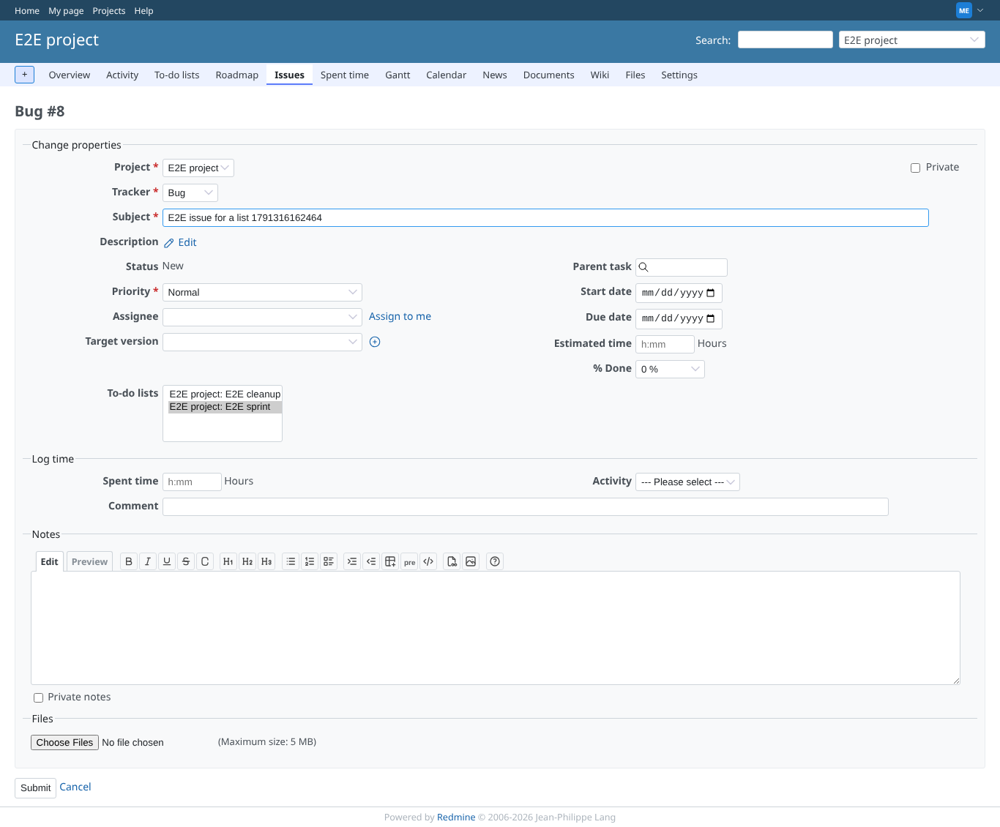
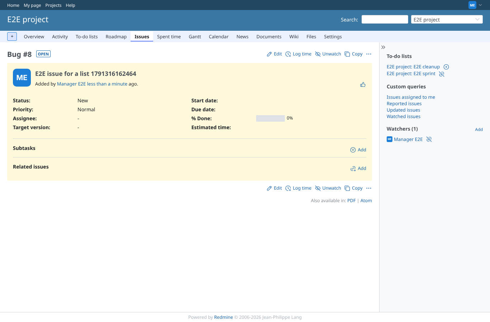
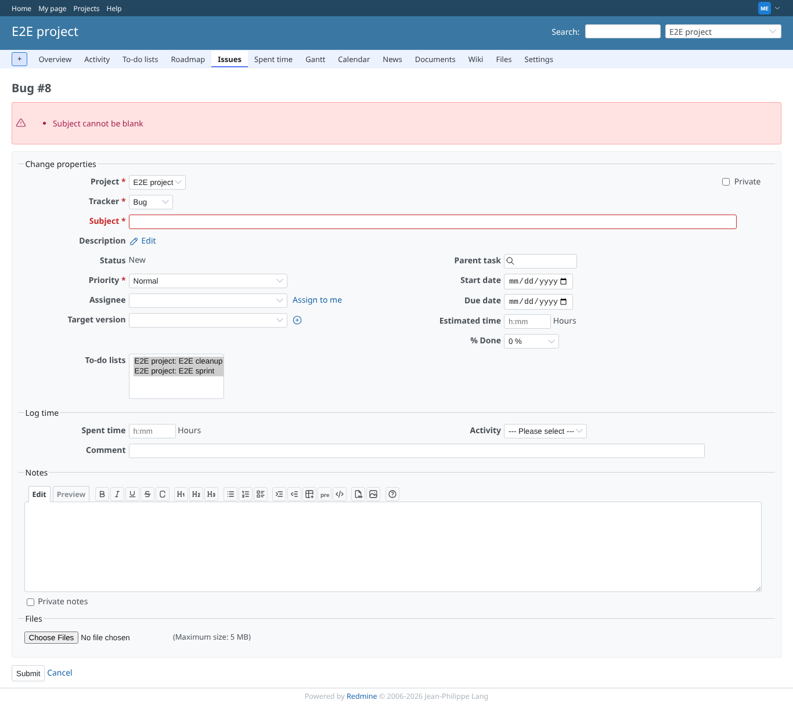

# issue_form

Run 2026-10-06T19:49:36.377Z against http://127.0.0.1:3000.

| screenshot | user | URL | shows |
|---|---|---|---|
|  | manager | `/projects/e2e-project/issues/new` | The new issue form offers the project's to-do lists; E2E cleanup is chosen |
|  | manager | `/projects/e2e-project/issue_todo_lists/2` | The new issue is on E2E cleanup |
|  | manager | `/issues/8/edit` | Editing: E2E sprint chosen, E2E cleanup no longer |
|  | manager | `/issues/8` | The sidebar shows the issue on E2E sprint (remove button) and not on E2E cleanup (add button) |
|  | manager | `/issues/8` | A blank subject is refused; the form keeps both chosen lists |
|  | reporter | `/projects/e2e-project/issues/new` | A member without the plugin's permissions gets the issue form without the to-do list field |
