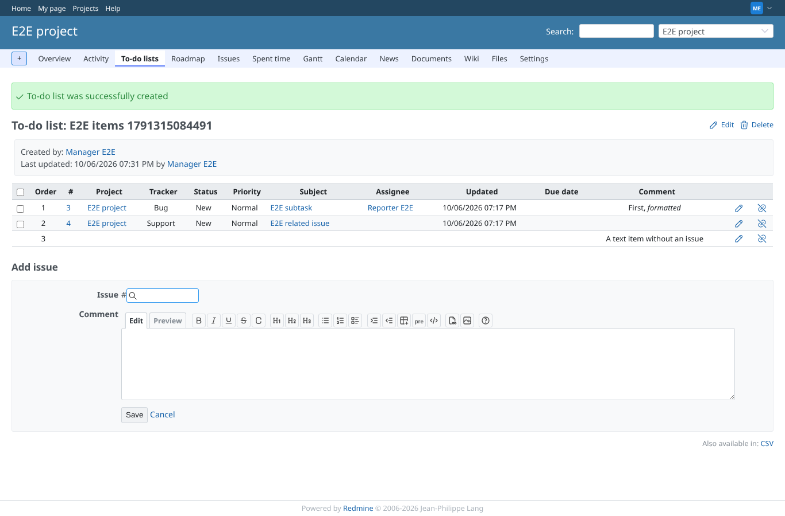
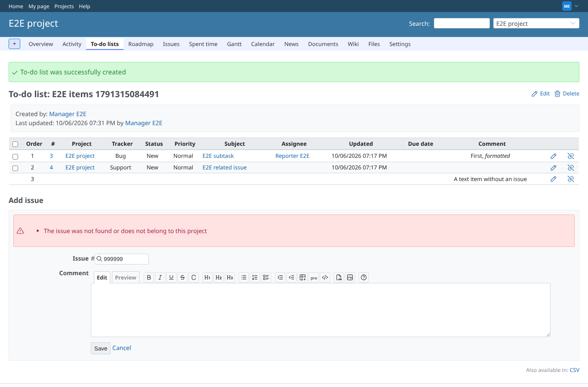
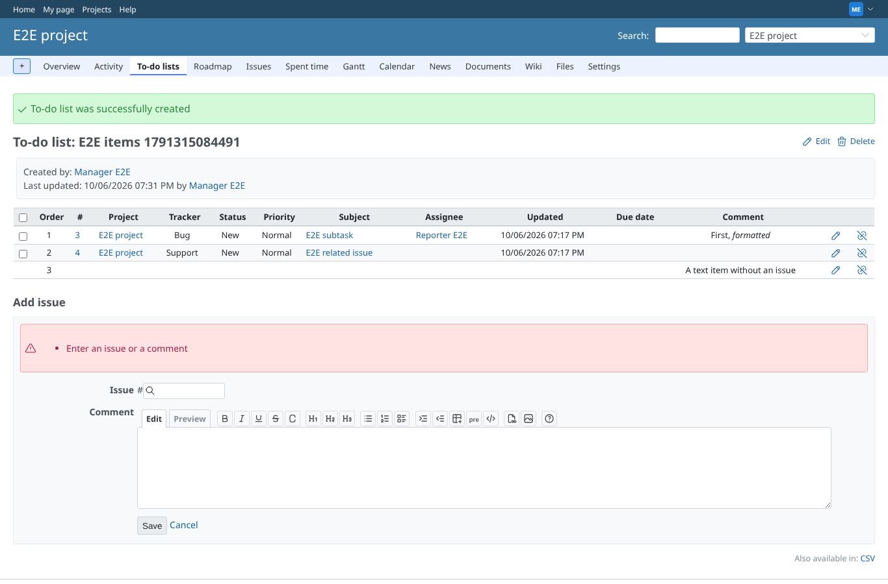
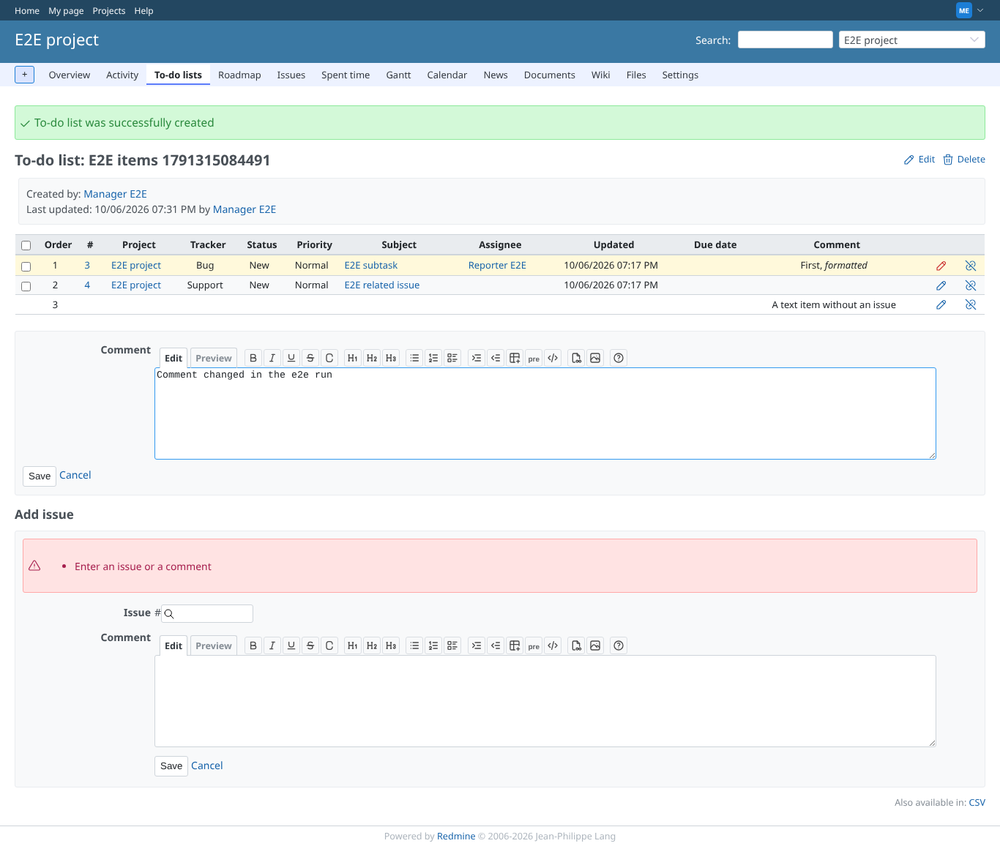
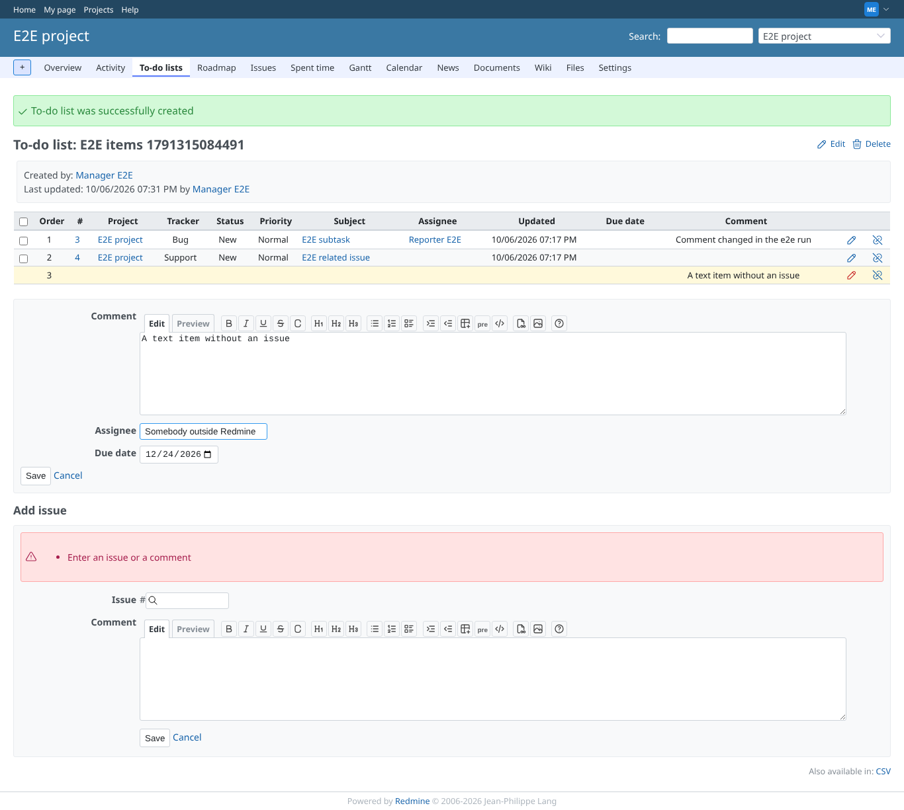
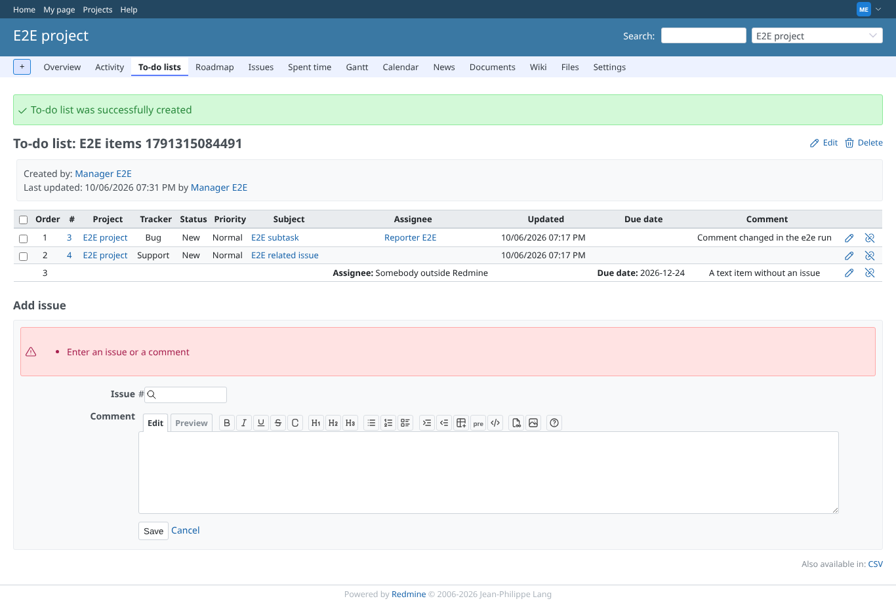
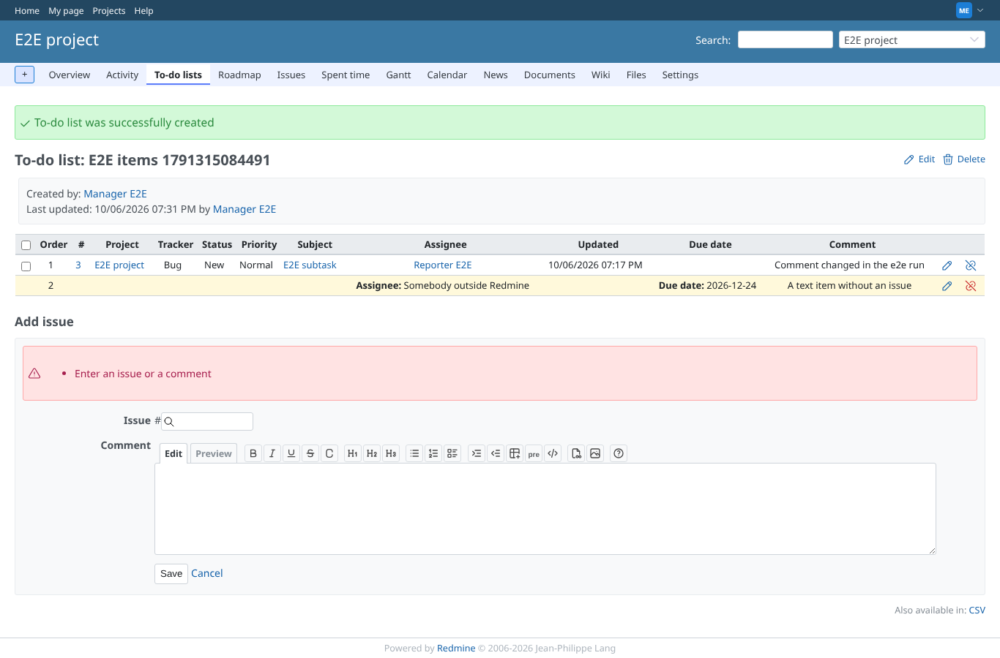
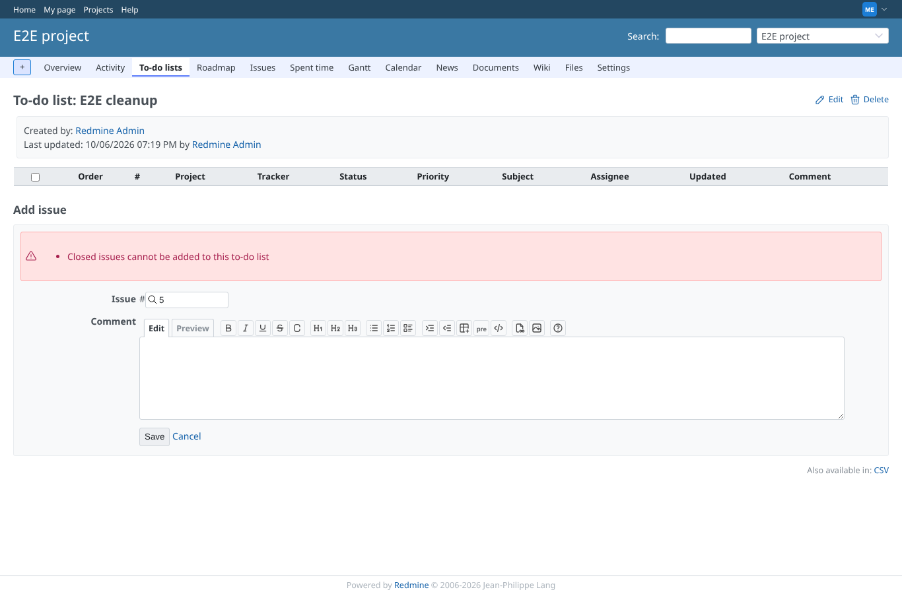
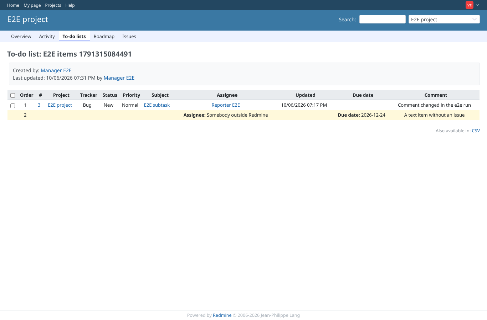

# items

Run 2026-10-06T19:31:33.254Z against http://127.0.0.1:3000.

| screenshot | user | URL | shows |
|---|---|---|---|
|  | manager | `/projects/e2e-project/issue_todo_lists/6` | An issue by number, one with #, and a text item are added without reloading; the comment is formatted |
|  | manager | `/projects/e2e-project/issue_todo_lists/6` | An unknown issue number is refused with an error, nothing is added |
|  | manager | `/projects/e2e-project/issue_todo_lists/6` | An item without issue and without comment is refused |
|  | manager | `/projects/e2e-project/issue_todo_lists/6` | The edit form opens under the list with the current comment |
|  | manager | `/projects/e2e-project/issue_todo_lists/6` | A text item offers the fields the list includes: a date field for the due date, text for the assignee |
|  | manager | `/projects/e2e-project/issue_todo_lists/6` | The changed comment and the text item's values are shown in the list |
|  | manager | `/projects/e2e-project/issue_todo_lists/6` | After confirming, the item is removed and the order numbers stay contiguous |
|  | manager | `/projects/e2e-project/issue_todo_lists/2` | A list that removes closed issues refuses a closed issue with an error |
|  | viewer | `/projects/e2e-project/issue_todo_lists/6` | A view-only member sees the items, without add, edit or remove |
