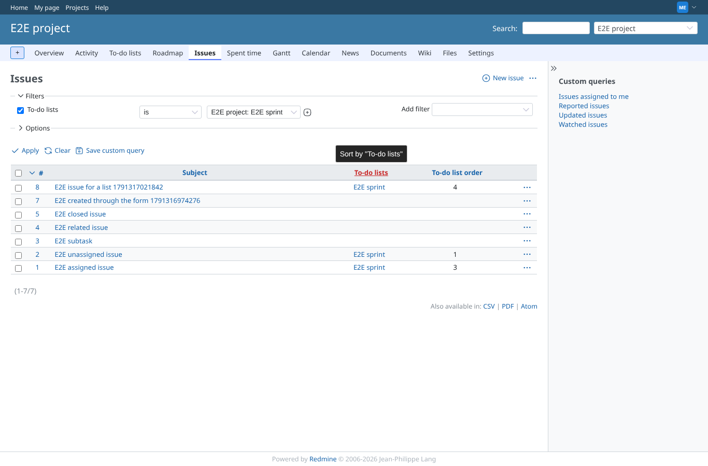
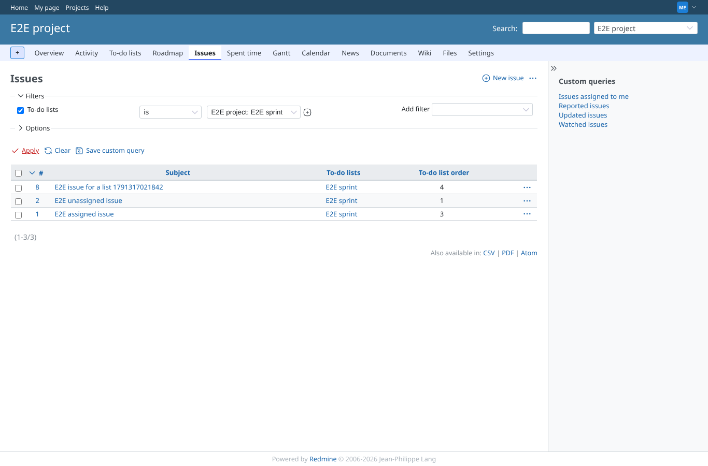
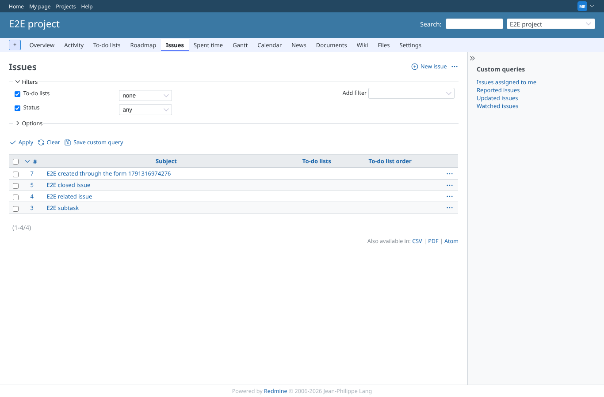
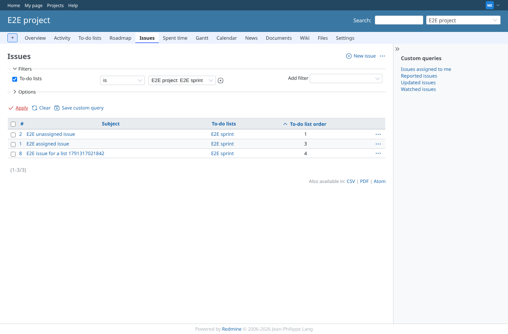
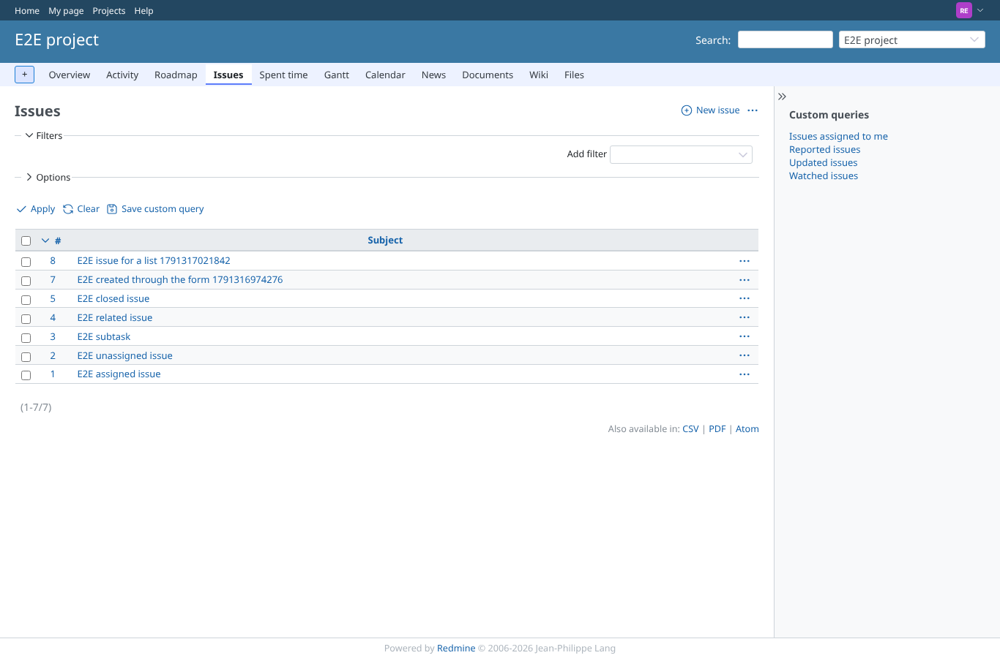

# issue_query

Run 2026-10-06T20:04:05.642Z against http://127.0.0.1:3001.

| screenshot | user | URL | shows |
|---|---|---|---|
|  | manager | `/projects/e2e-project/issues?set_filter=1&f[]=&c[]=subject&c[]=issue_todo_list_titles.titles&c[]=issue_todo_list_item_orders.positions` | The To-do lists filter is offered in the issue list and set to E2E sprint |
|  | manager | `/projects/e2e-project/issues?set_filter=1&sort=id%3Adesc&f%5B%5D=todo_lists_ids&op%5Btodo_lists_ids%5D=%3D&v%5Btodo_lists_ids%5D%5B%5D=1&f%5B%5D=&c%5B%5D=subject&c%5B%5D=issue_todo_list_titles.titles&c%5B%5D=issue_todo_list_item_orders.positions&group_by=&t%5B%5D=` | Filtered on E2E sprint: exactly the issues on that list, with the list titles as links and the order numbers |
|  | manager | `/projects/e2e-project/issues?set_filter=1&f[]=todo_lists_ids&op[todo_lists_ids]=!*&f[]=status_id&op[status_id]=*&c[]=subject&c[]=issue_todo_list_titles.titles&c[]=issue_todo_list_item_orders.positions` | The operator "none" shows the issues that are on no list |
|  | manager | `/projects/e2e-project/issues?set_filter=1&f[]=todo_lists_ids&op[todo_lists_ids]==&v[todo_lists_ids][]=1&c[]=subject&c[]=issue_todo_list_titles.titles&c[]=issue_todo_list_item_orders.positions&sort=issue_todo_list_item_orders.positions` | Sorted on the order column: by the lowest position each issue has on any list (README) |
|  | reporter | `/projects/e2e-project/issues?set_filter=1&f[]=todo_lists_ids&op[todo_lists_ids]==&v[todo_lists_ids][]=1&c[]=subject&c[]=issue_todo_list_titles.titles&c[]=issue_todo_list_item_orders.positions` | A member who may not view lists gets neither the filter nor the columns, even from a URL |
