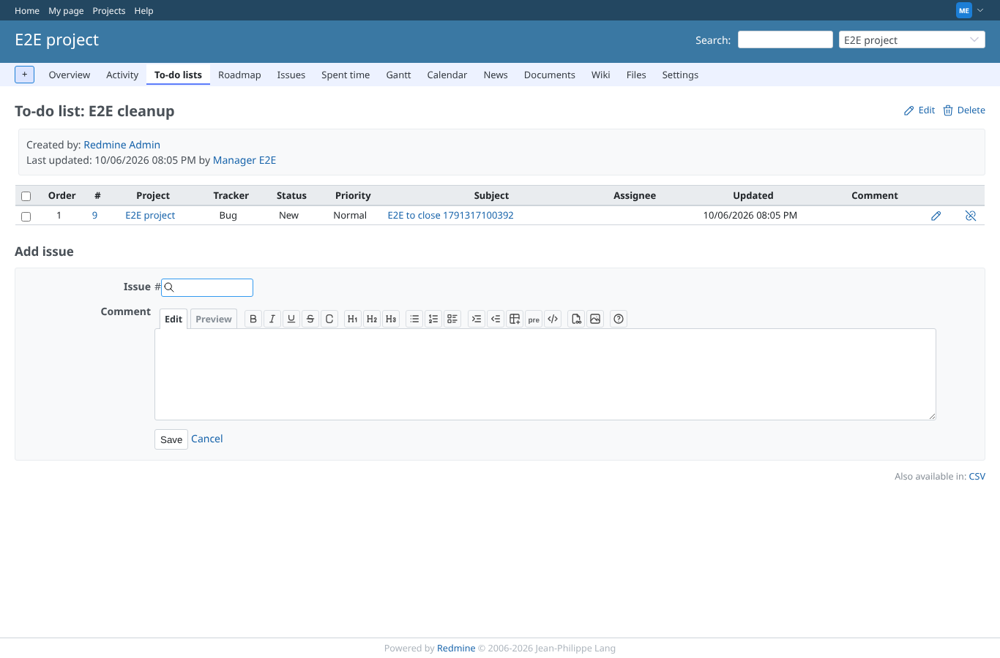
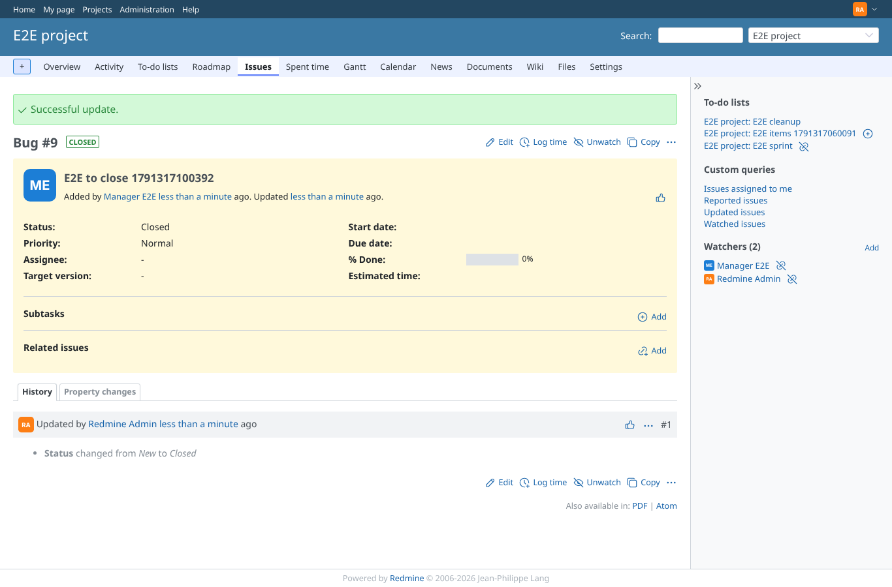
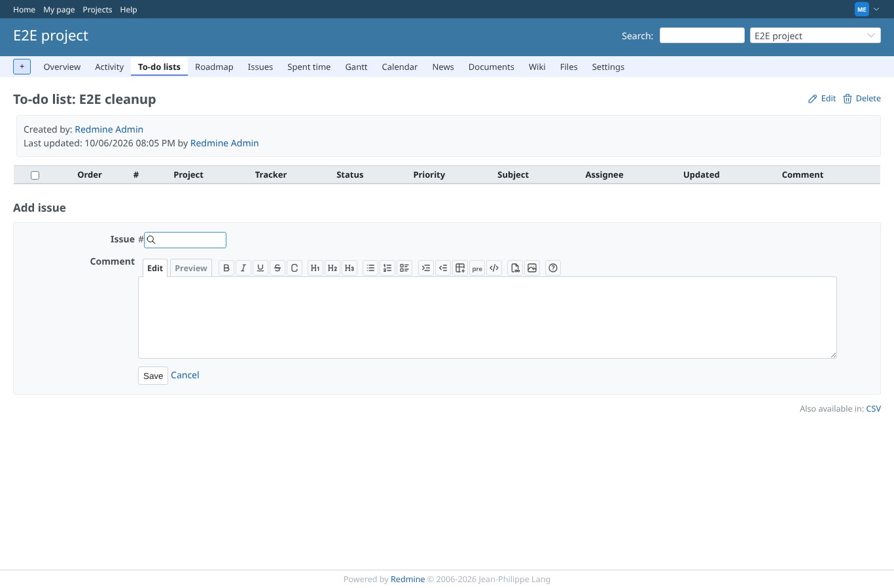
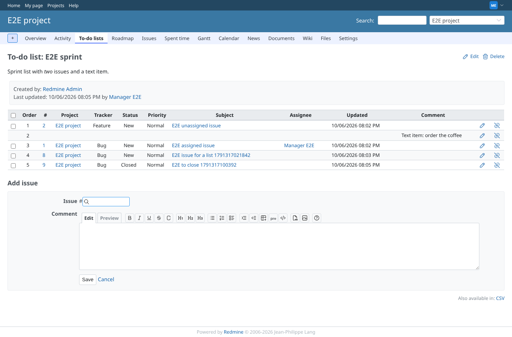
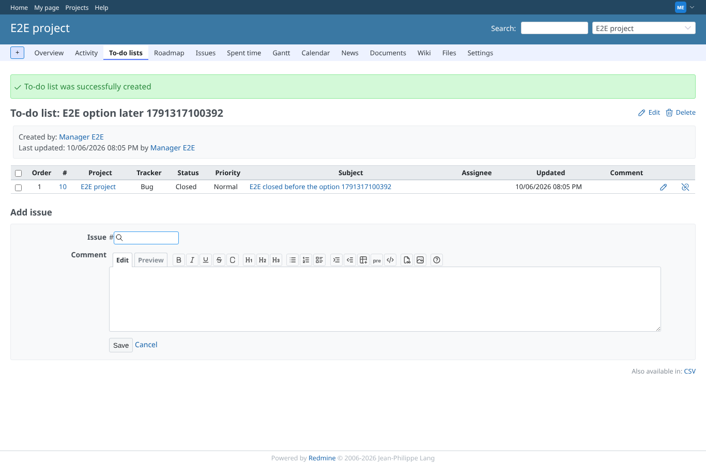
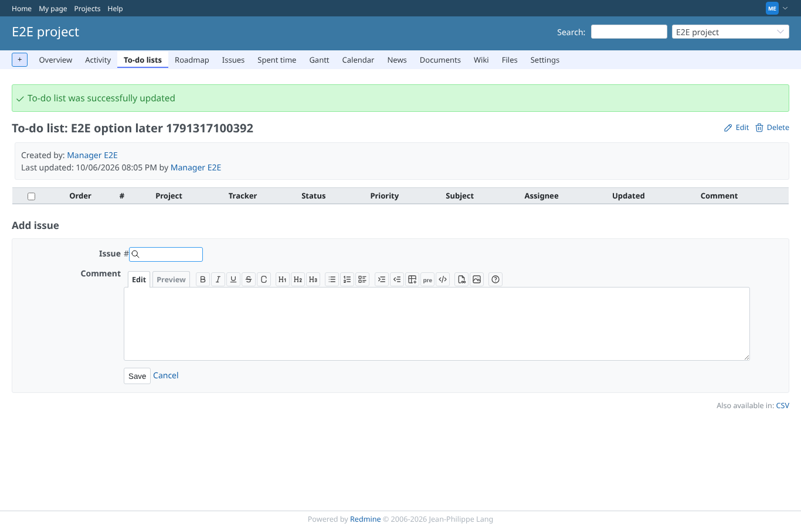

# remove_closed

Run 2026-10-06T20:05:22.679Z against http://127.0.0.1:3001.

| screenshot | user | URL | shows |
|---|---|---|---|
|  | manager | `/projects/e2e-project/issue_todo_lists/2` | An open issue on E2E cleanup (removes closed issues) and on E2E sprint |
|  | admin | `/issues/9` | The administrator closes the issue; the sidebar still shows it on E2E sprint (remove button), no longer on E2E cleanup |
|  | manager | `/projects/e2e-project/issue_todo_lists/2` | E2E cleanup no longer holds the closed issue |
|  | manager | `/projects/e2e-project/issue_todo_lists/1` | E2E sprint, without the option, keeps the closed issue |
|  | manager | `/projects/e2e-project/issue_todo_lists/6` | A list without the option accepts a closed issue |
|  | manager | `/projects/e2e-project/issue_todo_lists/6` | Switching the option on takes the closed issue off the list at once |
