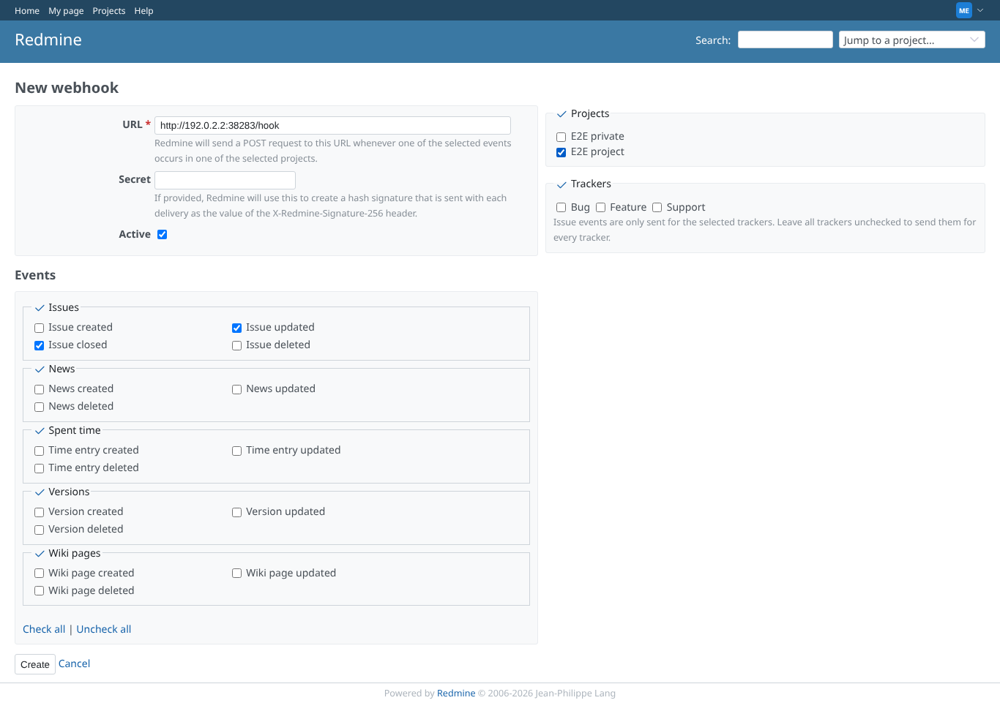
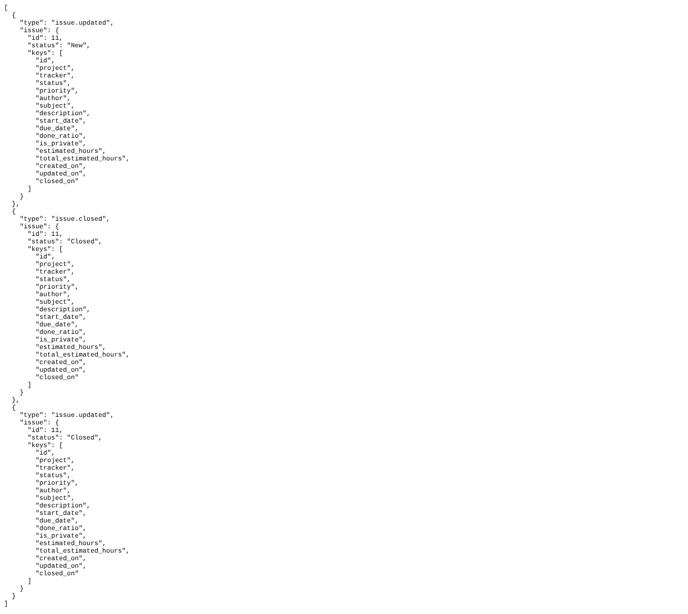
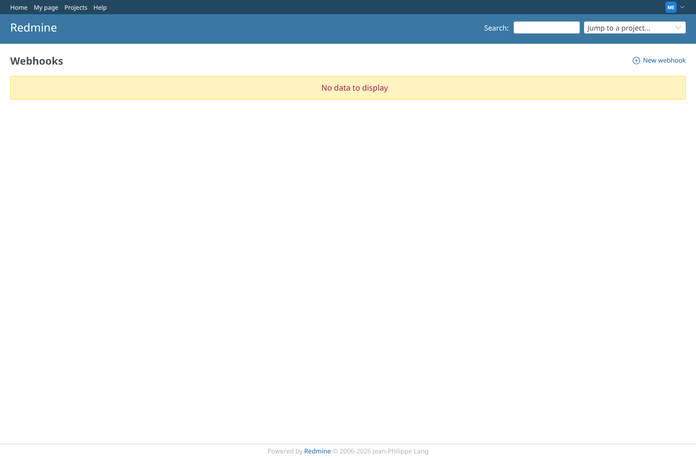

# webhooks

Run 2026-10-06T20:06:13.006Z against http://127.0.0.1:3001.

| screenshot | user | URL | shows |
|---|---|---|---|
|  | manager | `/webhooks/new` | The manager adds a webhook for issue updates and closes on E2E project, pointing at the scenario's listener |
|  | manager | `/projects/e2e-project/issue_todo_lists/2` | What the listener received: issue.updated after the form put the issue on E2E cleanup, issue.closed after closing (it left the list); no to-do list fields, like the issue API |
|  | manager | `/webhooks` | The scenario's webhook is deleted again |
