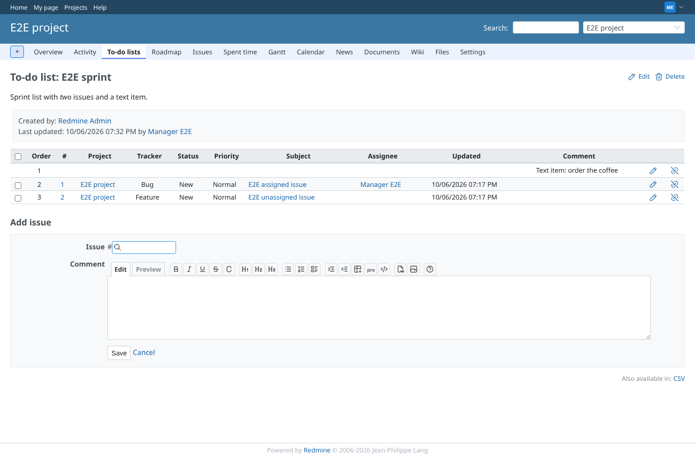
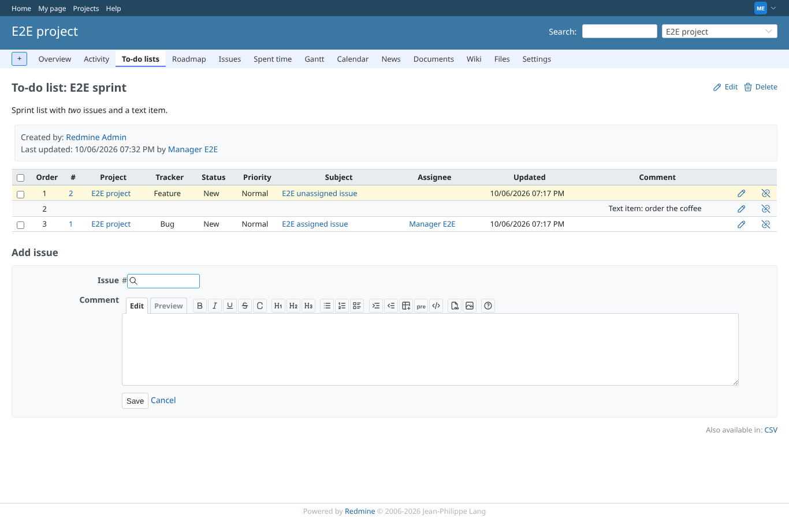
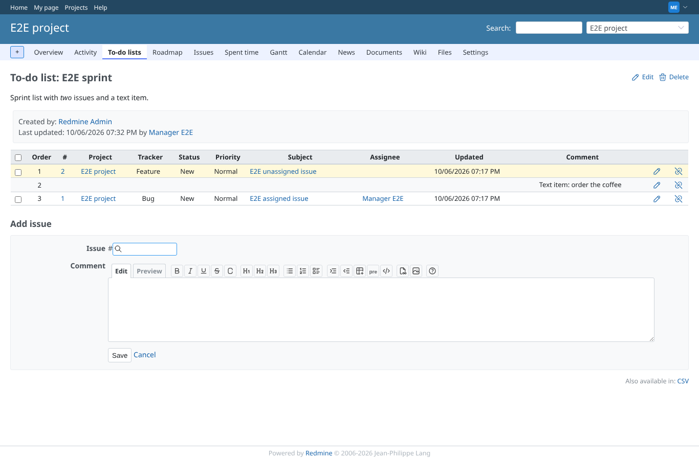
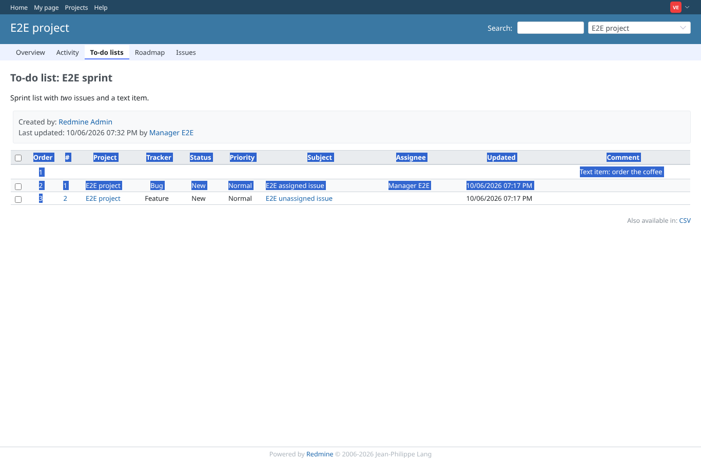

# ordering

Run 2026-10-06T19:32:40.705Z against http://127.0.0.1:3000.

| screenshot | user | URL | shows |
|---|---|---|---|
|  | manager | `/projects/e2e-project/issue_todo_lists/1` | E2E sprint before ordering; the table is sortable for a member with the permission |
|  | manager | `/projects/e2e-project/issue_todo_lists/1` | The last item is dragged to the top; the order numbers follow and the change is posted |
|  | manager | `/projects/e2e-project/issue_todo_lists/1` | After a reload the new order is still there, numbered 1 to 3 |
|  | viewer | `/projects/e2e-project/issue_todo_lists/1` | A view-only member drags in vain: the table is not sortable and the order stays |
