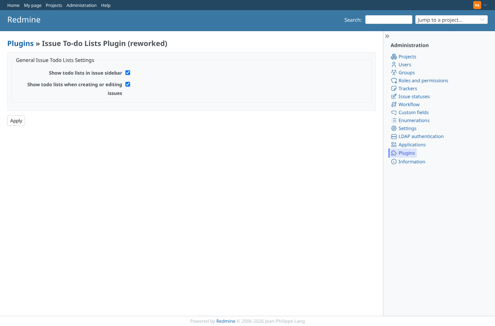
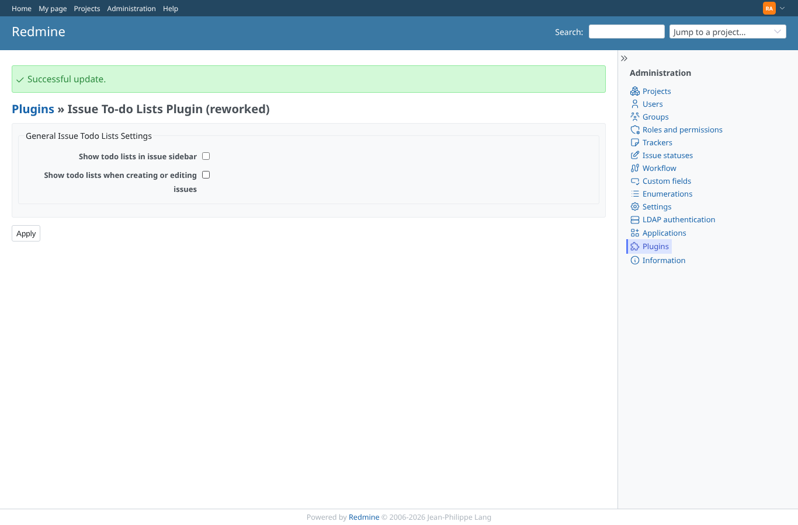
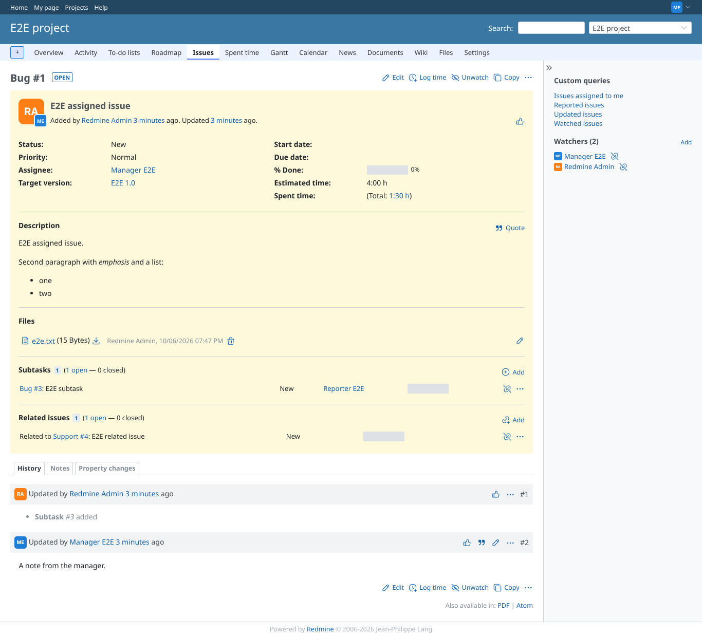
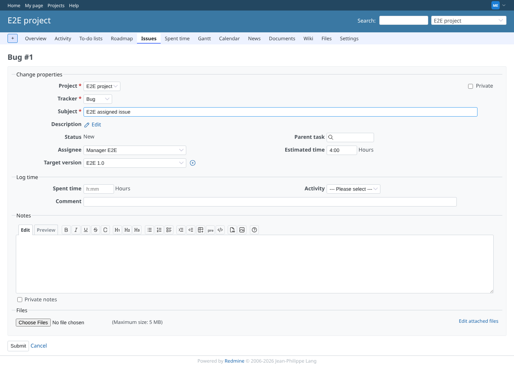
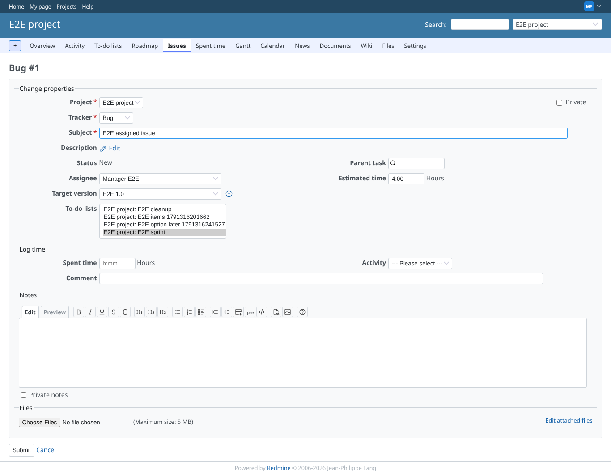

# settings

Run 2026-10-06T19:51:17.517Z against http://127.0.0.1:3000.

| screenshot | user | URL | shows |
|---|---|---|---|
|  | admin | `/settings/plugin/redmine_issue_todo_lists2` | The plugin settings page with both options on (the defaults) |
|  | admin | `/settings/plugin/redmine_issue_todo_lists2` | Both options switched off and saved |
|  | manager | `/issues/1` | With the sidebar option off, the issue page shows no to-do list block |
|  | manager | `/issues/1/edit` | With the edit option off, the issue form has no to-do list field |
|  | manager | `/settings/plugin/redmine_issue_todo_lists2` | The settings page is refused to a non-administrator (403) |
|  | manager | `/issues/1/edit` | Switched on again, the issue form shows the to-do list field |
